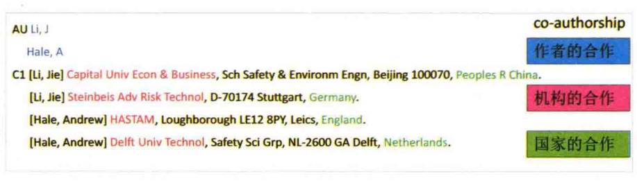
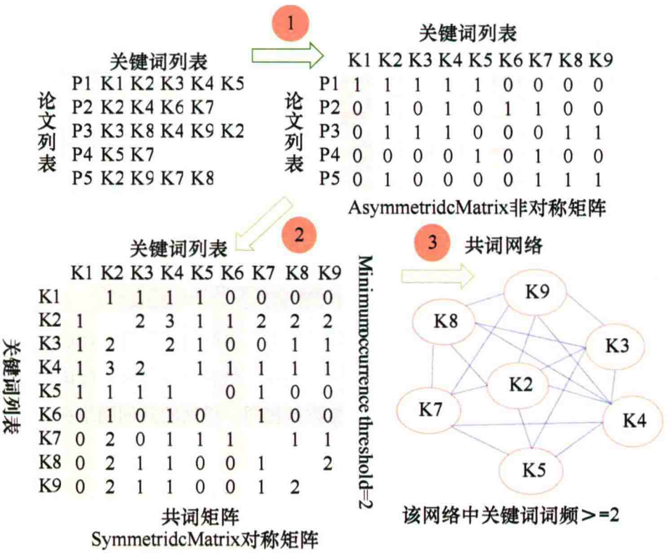

\mainmatter

# 方法论 {#method}

为了剖析肠道菌群的研究格局、历史脉络、研究热点，我们从知名的文献数据库中采集了历史文献信息，并采用文献计量学的方法分层推进、逐步深入，由总体到局部、由概况到细节，综合采用了多种分析手段，才最终得到了本文中涉及的一些相关结论。除了文献的数量，我们还特别关注了少数重要的核心文献，用于提炼研究热点，比较研究水平等；此外，还采用文献网络分析的手段对引证关系、合作关系和共词关系进行分析和可视化。

在这一部分，我们将对分析中采用的这两个重要方法做一个简单的描述。


## 如何确定核心文献？

前面提到，我们自 SCI 数据库中采集了 5 万多篇的研究论文，这些论文中孰轻孰重，哪一些是重点的核心文献，需要首先明确。否则的话，眉毛胡子一把抓，难免会不得要领。当前，评价文献的重要性最关键的指标应该就是引用次数了。所以，我们也是基于引用次数确定核心文献。


引用是引用分析的重要基础，引用次数是通常衡量一篇文献重要性的关键指标，并由此衍生出了期刊影响因子、研究人员的 H 因子等指标。在本分析中，我们主要使用了两种方法来定位核心文献。虽然他们都是基于引用次数，但是略有不同。

首先是 SCI 高被引论文。这是 SCI 数据库为每个领域内引用次数排在前 1% 的论文赋予的“荣誉称号”。高被引论文每年会更新几次，本分析中的数据囊括了 *2019年9月* 之前发表的高被引论文。

其次，在我们的分析中还使用了本地被引频次作为一个关键指标，来筛选与“肠道菌群”最相关的重要文献。与 SCI 数据库中的高被引文献相比，这一方法更能够发现与“肠道菌群”密切相关的重要文献。

可能有不少读者对本地被引频次这一概念不大清楚，所以我们先一起来看一下本地被引频次的含义。

**本地被引频次**，即 Local Citation Score（LCS）,它表示这篇文章在当前数据集中被引用的次数。

**全局被引频次**，即 Global Citation Score （GCS），它表示这篇文章被整个WOS数据库中所有文献引用的次数，也就是在 Web of Science 网站上看到的引用次数。

一篇文章GCS很高，说明被全球科学家关注较多。但是如果一篇GCS很高，而LCS很小，说明这种关注主要来自与你不是同一领域的科学家。此时，这篇文献对你的参考意义可能不大。如果 LCS 很高，则说明这篇文献与你数据集中关注的领域十分相关。所以，使用 LCS 可以快速定位一个领域的经典文献。

我们使用的数据集中，高被引论文一共有 `r nrow(highly_cited)` 篇高被引论文。我们按照 LCS 前 5% 筛选后得到的文献共有 `r nrow(MC)` 篇，其中覆盖了约三分之二的WoS高被引论文，比WoS高被引论文少了700多篇。不过，另外新增了约800多篇新文献（图 \@ref(fig:HC-vs-MC)）。

```{r HC-vs-MC, fig.cap="本地被引频次前5%的文献与WoS数据库高被引论文的重叠度", fig.width=6, out.width="50%"}
list <- list(HC=highly_cited$SR,MC=MC$SR)
ggVennDiagram::ggVennDiagram(list,category.names = c("WOS\n","本地\n"),label="both") +
  theme(legend.position = "none") +
  scale_x_continuous(expand = c(0.1,0.1)) +
  scale_y_continuous(expand = c(0.1,0.1))

```

 SCI 高被引论文以及本地高被引论文中额外的 1200 多篇论文，应当是肠道菌群研究论文中的精华，为此我们整理了论文的清单，列在图 \@ref(fig:vip-articles) 中。该表格可以查找、排序、过滤和点击。为了方便阅读，我们还将一些论文附上了《热心肠日报》的短科普链接（如果有的话[^daily-since-2016]）。与此同时，表格可以导出为 Excel 文档供本地查阅。

[^daily-since-2016]: 《热心肠日报》创刊于2016年初，所以这些精华论文中，如果是2016年以后发表的话，大概率会有相应的短科普解读。通过阅读短科普，你基本可以掌握这篇文章的大略情况。


```{r eval=run_and_save}
## 日报文章
db_cache <- "E:/Spring_Work/Corporate_Bussiness/C40_Data/cache/"
papers <- readRDS(paste0(db_cache,"papers.RDS")) %>% as_tibble()
fragments <- readRDS(paste0(db_cache,"fragments.RDS")) %>% as_tibble()


real_paper <- papers %>% 
  filter(status==3 & classify=="audit" & journal_id=="1") %>%
  select(uuid,title,share_title,summary,remark,fragment_id) %>% 
  left_join(fragments %>% rename("fragment_id"=id) %>% select(-uuid,-title,-remark)) %>%
  mutate(DI=toupper(doi))

saveRDS(real_paper,"data/real_paper.RDS")

real_paper <- readRDS("data/real_paper.RDS")%>% 
  select(DI,uuid,share_title) %>%
  group_by(DI) %>%
  filter(row_number() ==1)


MC_HC_article <- M %>%
  filter(CORE==TRUE | HC==TRUE) %>%
  as_tibble() %>%
  mutate(title=str_to_title(TI),
         source=paste0("<a href=\"https://doi.org/",DI,"\">原文</a>")) %>%
  left_join(real_paper) %>%
  mutate(title_en = ifelse(str_detect(DI,"^10"),
                           mrgut_permanent_link(base_url = "https://doi.org/",
                                                type = "html",
                                                uuid = DI,
                                                title = title,
                                                alt = "原文链接"),
                           title),
         daily_cn = ifelse(is.na(uuid),
                           "",
                           mrgut_permanent_link(type = "html",
                                                uuid = uuid,
                                                title = share_title,
                                                alt = "《热心肠日报》解读")))

J9_lvl <- MC_HC_article %>% group_by(J9) %>%
  summarise(avg_LCS=sum(LCS)) %>%
  arrange(desc(avg_LCS))
MC_HC_article$J9 <- factor(MC_HC_article$J9,levels = J9_lvl$J9)


saveRDS(MC_HC_article, "data/MC_HC_article.RDS")

rm(papers,fragments,real_paper)

```


```{r vip-articles, fig.cap="肠道菌群研究的精华论文（此处仅列示2016年以后发表的论文）"}
MC_HC_article <- readRDS("data/MC_HC_article.RDS") %>%
  mrgut::biblio_df()

DT::datatable(MC_HC_article %>% filter(PY >= 2016) %>% select(title_en,daily_cn), 
              colnames = c("文章标题","热心肠日报（如果有）"),
          escape = FALSE,
          rownames = TRUE,
          filter = "top",
          width = "95%",
          caption = "",
          extensions = c("Buttons"),
          options=list(dom = 'Bfrtip',
                       pageLength = 10,
                       buttons=list(
                         'pageLength',
                         list(extend='copy'),
                         list(extend="excel",
                              filename="VIP-article-in-gut-microbiome-study",
                              header=TRUE,
                              title="")
                         ),
                       columnDefs=list(
                         list(width="10%",targets=0),
                         list(width="45%", targets=c(1,2)),
                         list(width="200px",targets="_all")
                       ),
                       lengthMenu=list(c(10,20,50,100,200,-1),
                                       c("10","20","50","100","200","All")),
                       autoWidth=TRUE)) %>%
  DT::formatStyle(fontSize="9pt",columns = 0:4)
```


## 如何进行文献网络分析？{#network-concept}

本书中，主要针对文献资料做了 3 种类型的网络分析，分别是引用网络、合作网络和共词网络。下面对这三种网络予以简单介绍，以方便读者解读文中的相应结果。

### 文献的引用网络

文献的引用网络分析大体可分为两种，共被引和文献耦合网络。

共被引（co-citation）是指当两篇（或多篇）文献同时被后来一篇（或多篇）论文所引用的关系，同时引用这两篇论文的文献数目则称为共被引强度（图 \@ref(fig:co-citation-example)）。文献的共被引关系会随着时间的变化而变化。通过对文献共被引网络的研究可以探究科学的发展和演进动态。

```{r co-citation-example, fig.cap="共被引关系的示意图[@chenCiteSpaceIIDetecting2006]"}
include_graphics("citespace/co-citation-example.png",dpi = NA)
```

文献耦合（coupling）是指若文献A和文献B引证了相同的参考文献，则它们之间构成耦合关系，它们所包含相同参考文献的个数成为耦合强度。如果两篇文献同时引用了1篇文献，则耦合度为1；若同时引用了3篇文献，则耦合度为3。两篇文献拥有的共同参考文献越多，则其研究内容越相似（图 \@ref(fig:coupling-example)）。

```{r coupling-example, fig.cap="文献耦合的示意图[@chenCiteSpaceIIDetecting2006]"}
include_graphics("citespace/coupling-example.png",dpi = NA)
```


从文献耦合的概念上看，一个文献引用的参考文献越多，那么它将有越多的机会与其它文献建立耦合关系。为了消除这种影响，通常需要对原始数据使用 Jaccard 或 Salton 方法进行标准化处理，来计算相对的耦合强度。文献耦合测量的是文献间的静态关系，已经发表的论文的耦合强度不会随时间的变化而变化。


### 合作网络

合作网络可以有多重表现形式，存在于作者、机构和国家等不同层面。只要在同一篇文献中同时出现，就可以视为一种合作（图 \@ref(fig:co-authorship-example)）。


```{r co-authorship-example,fig.cap="合作网络的体现形式[@chenCiteSpaceIIDetecting2006]"}

```


### 共词分析

共词分析的基本原理是对一组词两两统计他们在同一组文献中出现的次数,通过这种共现次数来测度他们之间的亲疏关系。共词分析的一般过程如图 \@ref(fig:co-occurance-example) 所示。通常是提取每一篇论文的关键词列表，这里P1表示文献1,K1表示关键词1,相同的关键词使用相同的字母和数字组合表示。这样就可以得到一个文档-关键词矩阵，该矩阵为0-1矩阵,表达的含义关键词和文献的隶属关系。

```{r co-occurance-example,fig.cap="共词关系的示意图[@chenCiteSpaceIIDetecting2006]"}

```


```{r eval=keep_but_not_include}
# ## 使用本地引用文献数确定近几年的重要文献
# 
# 
# 在这里，我们也相应的介绍一下本地参考文献数这一概念。
# 
# **本地引用文献数**（Local Cited References，LCR）表示这篇文献的参考文献在当前数据集中的数量，即这篇文献引用别人的情况。
# 如果一篇文章的 LCR 值高，意味着它引用了大量当前数据集中文献，极有可能是对当前数据集中研究密切相关的综述文章。
# 
# **引用文献数目**（Cited Reference，CR）即文章引用的参考文献数量。如果某篇文献引用了50篇参考文献，则 CR 为50。
# 
# 我们知道引用有一定的滞后性，而 LCR 可以帮助我们快速找出最新的文献中哪些是和自己研究方向最相关的文章。
```


### 文献网络的简化

文献网络是一个联系度非常高的网络，在对其进行分析和可视化的时候，如果不对网络进行简化，那么只能得到一个盘根错节、处处链接的网络。
这样，无论是对网络进行聚类分析，还是对网络进行可视化，效果都相当糟糕。所以，需要对网络进行简化，去掉联系度不紧密的关系，只保留最关键的节点和关系。


```{r}
reference_coupling_networks <- readRDS("data/reference_coupling_networks.RDS")
reference_coupling_networks[[20]]$graph -> g

```

以文献耦合网络为例，网络中任意两篇文献间联系的紧密度是文献数目。`E(g)$weight` 就是图 `g` 边的 weight，将其做 `log10()` 转变后，基本符合一个正态分布。

```{r}
par(mfrow=c(1,2))
hist(E(g)$weight)
hist(log10(E(g)$weight))

```

```{r}
quantile(log10(E(g)$weight),probs = 1:10/10) -> lims
gs <- lapply(1:length(lims),function(i) delete.edges(g, which(log10(E(g)$weight) < lims[[i]])) %>% igraph::simplify())
```

鉴于此，我们会将一些权重（Weight）较低的边删掉，在此基础上进一步可视化，以期得到一个较为简化的网络。

```{r fig.width=12,fig.asp=1}
par(mfrow=c(2,2))
success <- lapply(gs[c(3,6,8,9)],function(x){
    x <- delete.vertices(x,which(degree(x)<1))
    c <- cluster_louvain(x)
    plot(c,x,layout=layout.kamada.kawai,vertex.label=NA,edge.curved=TRUE,main="")
  })
```


通过对网络结构的优化，可以更加突出的展示关键的信息，从而形成了本书中最终的网络可视化效果。
在实际显示的时候，每个网络还要经过参数的优化，达到最佳的展示效果。
并且，正文中的网络统一采用了可交互技术，读者可以放大、缩小甚至编辑网络中的元素（仅部分网络允许编辑）。


## 核心论文的分类

核心论文的分类我们采用的是关键词检索方式进行。这种方法虽然比较原始，但是却是最直观、最容易理解的一种途径。在检索的过程中，我们拟定了合适的正则表达式，以确保主题核心词被完整的纳入进来。举例来说，针对于“饮食”主题，我们设定的关键词包括“diet”，“diet*”，以及“food|nutrition|supplement|fasting|calorie restriction|fibre|fiber|carbohydrate|meat|fish|egg|milk|dairy|fruit|vegetable|additives|sweetener”等其它一些相关的关键词。


