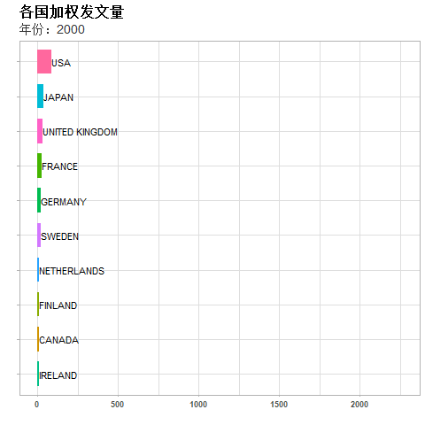

\mainmatter

# (PART) 概况 {-}

# 研究概述 {#intro}

在这一章节，通过展示WoS数据库中相关研究二十年（2000-2019）的大数据[^data-source]，我们将对肠道菌群研究的概况做一个梳理。

[^data-source]: 关于数据源的说明，请查看“附录-数据来源”部分的说明。


在WoS收录的每一篇论文中，都记载着文章的作者、发表期刊、研究机构、关键词和学科分类等信息。其中，关键词又分为两类：一是作者标记的关键词；二是数据库为每一篇文章分配的关键词。在本书中，我们将前者统一称为“作者关键词”，后者称为“系统关键词”，以示区别。另外，根据选择标准的差异，学科分类也分为“研究类别”和“研究方向”两块。

通过对这些项目的汇总，我们首先可以有一个**大体印象**。

```{r M-summary,fig.asp=1,fig.width=6,fig.cap=paste(nrow(M), "篇文献的大数据")}
columns <- c("AU_CO_NR","AU_UN_NR","AF","J9","DE","ID","WC","SC")
col_names <- c("国家/地区","研究机构","作者","期刊","作者关键词","系统关键词","研究类别","研究方向")

# table class 分类计数
tag_summary <- lapply(columns, function(col){
  tableTag(data.frame(M), Tag = col)
})

# 每个分类的总的数目
tag_summary_n <- sapply(tag_summary, length)

# 画图所用的数据
df <- data.frame(x=0, y=0, 
                 label=paste(c(nrow(M),tag_summary_n),c("文章",col_names),sep = "\n"), # 加入文章总数
                 no = 0:length(tag_summary_n))
# 画图
ggplot(df,aes(x,y,label=label)) +
  geom_point(shape=21,size=50,color="#467AB4",stroke=2,fill="lightblue",alpha=1/2) +
  geom_text(fontface="bold") +
  scale_size(range = c(1,30)) +
  facet_wrap(~no) +
  theme_void() +
  theme(strip.text = element_blank())


```

二十年间，一共发表了 `r nrow(M)` 篇“肠道菌群”相关的研究论文。这些文献由来自于世界 `r tag_summary_n[[1]]` 个国家和地区 `r tag_summary_n[[2]]` 个研究机构的累计 `r tag_summary_n[[3]]` 个不同的作者（依全名区分）发表在 `r tag_summary_n[[4]]` 种不同的期刊上。这些文献的作者为它们指定了 `r tag_summary_n[[5]]` 个不同的关键字，而Web of Science数据库系统为它们分配了 `r tag_summary_n[[6]]` 个不同的关键字，并将其归为 `r tag_summary_n[[7]]` 大类、 `r tag_summary_n[[8]]` 个不同的大的研究方向（图 \@ref(fig:M-summary)）。


如果没有做这一个统计，很难想象这二十年的肠道菌群研究会有这样的结果。尤其是这 5 万多篇文章居然有多达 2 万多个机构和 18 万以上的研究人员完成。特别是，我们对于作者的区分仅仅局限为全名，尚没有考虑重名的现象（重名现象在中国人中是非常普遍的，例如汪俊、王军等的拼音都是Wang Jun）。可想而知这些文章背后是一个多么**庞大的学术团体**。

此外，5 万多篇文章有多达 4.6 万的作者关键词和 4.7 万的系统关键词。平均下来几乎每一篇论文都贡献了一个不同的关键词出来。或者说，如果每一篇文章都只有一个关键词的话，每篇文章的关键词都不相同。这充分体现了肠道菌群研究所涉及到的**广度和细分度**。

## 肠道菌群是一个高速发展的研究领域

“日积跬步，以致千里”。肠道菌群研究发展到如此巨大的一个体量，是日积月累的一个结果。且值得注意的一点是，这个积累的过程并非是匀速向前的，而是以一种近乎指数增长的趋势进行的。图 \@ref(fig:trend-publications) 展示了每年发文量和累计发文量的增长趋势，累计发文量的增长趋势在这幅图中可见一斑。从曲线的走势上看，“肠道菌群”研究在今后相当长的时间应当仍是一门快速增长的研究领域，会持续不断有更多的研究论文面世。


```{r}
# 按年份统计发文量、累计发文量和增量
count_by_year <- M %>% group_by(PY) %>% summarise(count=n()) %>%
  mutate_at("PY",as.numeric) %>%
  ## 计算增量
  mutate(increment = c(0,diff(count)),
         cumsum = cumsum(count)) %>%
  mutate(increasing_rate = increment/count[ifelse(row_number()>1,row_number()-1,1)])
```


```{r trend-publications, fig.cap="每年发表的文章数量（柱状图）和累计发文量的增长情况（折线图）"}
p <- ggplot(count_by_year) + 
  aes(x=PY) +
  geom_line(aes(y=cumsum), size = 1) + 
  geom_point(aes(y=cumsum,text=cumsum),size=3,fill="white",shape=21) + 
  geom_col(aes(y=count,text=count)) +
  # geom_text(aes(y=count+10,label=count),hjust=1,vjust=-0.2) +
  labs(x="年份",y="数量",title = "每年发文量和累计发文量的增长情况") + 
  scale_y_continuous(labels = function(x) paste0(round(x/1e4),"万"),
                    breaks=1:10*1e4) +
  xlim(c(2000,2020)) +
  theme_labs
plot.ly(p) 
```

具体到每年的发文量，从 2000 年的三百余篇增长到 2019 年的近一万篇，增长了近三十倍。年均同比增长率基本保持在 10% 以上，特别是 2012-2017 年间连续六年同比增长率保持在 20% 以上。2018年以来，虽然较之有所下降，但仍然在 10% 以上（图 \@ref(fig:trend-publications-increasing-rate)）。


```{r trend-publications-increasing-rate, fig.cap="发文量的同比增长率"}
count_by_year$text <- paste(round(count_by_year$increasing_rate*100,1),"%",sep = "")
p <- ggplot(count_by_year,aes(PY,increasing_rate)) + 
  geom_line(size = 1) + 
  geom_point(aes(text=text),size=3,fill="white",shape=21) + 
  # geom_text(aes(y=count+10,label=count),hjust=1,vjust=-0.2) +
  labs(x="年份",y="同比增长率",title="发表文章数量较去年的同比增长率") + 
  xlim(c(2000,2020)) +
  scale_y_continuous(labels = function(x)paste(x*100,"%"))
plot.ly(p,tooltip = c("x","text"))
```

## 肠道菌群研究仍然在收获持续的关注

在发文量的基础上，我们进一步的研究了论文引用量的变化趋势（图 \@ref(fig:trend-TC)）。与论文发表量不同，论文的总的引用次数呈现出一个“S”型曲线出来。这主要是由于最近 5 年的论文引用次数下降造成的。这是不是就意味着，肠道菌群研究已经不再那么引人关注了呢？答案是否定的。我们认为出现这一情况的主要原因是由于引用这一行为具有滞后性，导致近几年发表的文献尚需时日才能被广泛引用，所以才会出现 2014 年以后发表的新文献的引用次数较2014年的文献引用次数呈逐渐下降的趋势。

```{r trend-TC, fig.cap="文献年度被引频次（柱状图）和累计被引频次（折线图）的变化趋势"}
TC_by_year <- M %>% group_by(PY) %>%
  summarise(total=sum(TC,na.rm = TRUE)) %>%
  mutate(cumsum=cumsum(total))

trend_TC <- ggplot(TC_by_year,aes(PY)) + 
  geom_line(aes(y=cumsum),size = 1) + 
  geom_point(aes(y=cumsum,text=total),size=3,fill="white",shape=21) + 
  geom_col(aes(y=total,text=total)) +
  labs(x="年份",y="被引频次",title = "文献年度被引频次和累计被引频次") + 
  scale_y_continuous(labels = function(x) paste0(round(x/1e4),"万"),
                    breaks=seq(0,200,by=50)*1e4) +
  xlim(c(2000,2020))

plot.ly(trend_TC)
```


为了进一步说明这个问题，我们不妨另外来看**文献使用次数**这一重要参数。SCI 数据库中保留了最近 180 天（半年）的文献使用次数。每条数据被访问一次，会被记录为一次使用。相比引用次数，使用次数具有更高的时效性，因此更加能够显示近期人们对相关论文的关注度。


```{r}
U1U2_by_year <- M %>% 
  mutate_at(c("U1","U2"),as.numeric) %>%
  group_by(PY) %>%
  summarise(total_U1=sum(U1,na.rm = TRUE),
            total_U2=sum(U2,na.rm = TRUE))
```

```{r trend-U1U2, fig.cap="每年发表的文献在近180天的使用次数"}
trend_U1U2 <- ggplot(U1U2_by_year,aes(PY,total_U1,text=total_U1)) + 
  geom_line(size = 1) + 
  geom_point(size=3,fill="white",shape=21) + 
  labs(x="年份",y="使用次数") + 
  xlim(c(2000,2020)) +
  scale_y_continuous(labels = function(x) paste0(round(x/1e4),"万"),
                    breaks=1:10*1e4) 

plot.ly(trend_U1U2)
```

从图 \@ref(fig:trend-U1U2) 中看，可以发现最近半年间人们对肠道菌群相关文献的访问次数呈现显著的增长趋势。这当然是因为人们在阅读的时候更愿意去看最近发表的文献，另一方面也说明研究人员对肠道菌群研究的最新成果仍然保有持续的关注。可以预见，这些关注将在未来的几年逐渐反映到引用次数的增加上去。


所以说，肠道菌群研究仍然在收获持续的关注。不过，2018年以来的新趋势也提醒我们，“肠道菌群”研究已经进入深水区，如果没有原创性的亮点工作，未来发文的难度应当会有所增加。

```{r}
# 以下项目将展示前面几条
n <- 20
```


## 肠道菌群研究建立在广泛的全球合作之上


在国家（地区）层面，美国的发文量最多，占了全部文章的三分之一以上（33.6%）。发文量排第二位的是中国（包括港澳台），约为总文章数的七分之一（14.4%）。发文量排在前二十位的国家（地区）还有英国、德国、法国、意大利、加拿大、日本、西班牙、荷兰、澳大利亚、瑞典、比利时、芬兰、巴西、韩国、丹麦、爱尔兰、芬兰和印度等国（图 \@ref(fig:summary-country)）。


```{r summary-country, fig.cap="二十年间在肠道菌群研究中发文量最大的国家（地区）"}
# data
i <- 1
df <- tag_summary[[i]] %>% as_tibble()
colnames(df) <- c("Country","all")
  
df <- df %>%
  filter(Country!="NA") %>%
  mutate(Country=ifelse(is.part_of_china(Country),"CHINA",Country)) %>%
  group_by(Country) %>%
  summarise_at("all",sum) %>%
  mutate(proportion=all/nrow(M)) %>%
  mutate(text=paste(all," (",round(proportion*100,1),"%)",sep = "")) %>%
  left_join(country_multi_lang,by=c("Country"="countries")) %>%
  arrange(desc(all)) %>%
  head(n) %>%
  arrange(all) %>%
  mutate(Country=as_factor(as.character(Country)),
         China=as_factor(as.character(China)))

# plot
p <- ggplot(df, aes(China,all,text=text)) +
  geom_col() +
  coord_flip() +
  labs(x="",y="文章总数",title = "发文量最大的国家（地区）")  +
  scale_y_continuous(labels = function(x) paste0(round(x/1e4,1),"万"),
                    breaks=(0:20)/2*1e4) 
plot.ly(p)
```


```{r MCP-SCP, fig.cap="各国独立发表（SCP）和多国合作发表（MCP）论文的比例"}
mostProdCountries <- tableTag(M, Tag = "AU_CO_NR") 
mostProdCountries <- as_tibble(mostProdCountries) 
colnames(mostProdCountries) <- c("Country","all")

scp <- tableTag(M %>% filter(str_detect(AU_CO_NR,";")), "AU_CO_NR")
scp <- as_tibble(scp)
colnames(scp) <- c("Country","SCP")

mcp <- tableTag(M %>% filter(!str_detect(AU_CO_NR,";")), Tag = "AU_CO_NR")
mcp <- as_tibble(mcp)
colnames(mcp) <- c("Country","MCP")

top_country <- mostProdCountries$Country %>% head(n)

mostProdCountries <- mostProdCountries %>%
  filter(Country != "NA") %>%
  left_join(scp) %>% 
  left_join(mcp)  %>% 
  mutate(Country=ifelse(is.part_of_china(Country),"CHINA",Country)) %>%
  group_by(Country) %>%
  summarise_all(sum) %>%
  filter(Country %in% top_country) %>%
  left_join(country_multi_lang,by=c("Country"="countries")) %>%
  pivot_longer(cols = c("SCP","MCP"),names_to = "name",values_to = "value") %>%
  mutate(value=as.numeric(value),
         Country=as_factor(as.character(Country))) %>%
  mutate(proportion=value/all) %>%
  ungroup() %>%
  arrange(all) %>%
  mutate(Country = as_factor(as.character(Country)),
         China = as_factor(as.character(China)))


library(ggflags)
p <- ggplot(mostProdCountries,
            aes(China,value,fill=name,text=paste0(value,"(",format(proportion*100,1),"%)"))) + 
  geom_col() +
  coord_flip() +
  # geom_flag(aes(country=tolower(ISO2)),y=-200,size=10) +
  labs(title = "各国独立和合作发表论文的比例",x="",y="") +
  scale_fill_discrete(name="",breaks=c("SCP","MCP"),labels=c("独立发表","合作发表")) +
  scale_y_continuous(labels = function(x) paste0(round(x/1e4,1),"万"),
                    breaks=(0:20)/2*1e4) +
  theme(legend.position = c(0.5,0.3))

plot.ly(p) %>%
  layout(
    legend = list(x=0.5,y=0.3,orientation="v")
  )
  
```


国际合作在“肠道菌群”研究论文中很常见（图 \@ref(fig:MCP-SCP)）。在最主要的`r n` 个国家中，美国的研究有近 64% 是与其它国家合作完成的，中国与其它国家合作发表论文的比例更高，占到全部文章的 70% 以上；英、德、法、意、加等国的合作研究比例在 30% 以上。所有这些国家中，对外合作发表文章的比例为 `r paste0(round(mean(mostProdCountries$proportion)*100),"%")`。这充分说明了**国际合作在肠道菌群研究中占重要地位**。

由于国际合作研究的盛行，一半左右的文章会出现由来自于多个国家的研究人员共同完成的情况。所以，只仅仅通过加和计算国家间的贡献可能有失公允。因此，我们进一步计算了加权发文量。我们认定，当一篇论文的所有作者都来自于同一个国家（地区）时，对应国家的贡献记为 1；当一篇论文的作者来自于多个国家时（N），每个国家对应的贡献记为 1/N。


```{r}
# 计算各国加权发文量
listCO <- strsplit(M$AU_CO_NR,";")
listCO <- lapply(listCO,trim)
nCO <- unlist(lapply(listCO,length))
fracCO <- unlist(lapply(nCO, function(x){rep(1/x,x)}))

if (length(M$PY) != length(nCO)) warning("length(PY) is not equal to length(nCO).")
PY <- unlist(lapply(seq_along(nCO),function(x){rep(M$PY[[x]],nCO[[x]])} ))


country_output <- data.frame(CO=unlist(listCO),
                             PY=PY,
                             Frac=fracCO) %>%
  group_by(CO,PY) %>%
  summarise(contribution=sum(Frac))
```


```{r}

list <- lapply(unique(country_output$PY),function(y){
  country_output %>% filter(PY==y, CO!="NA") %>%
    arrange(desc(contribution)) %>%
    head(10) %>% 
    ungroup() %>%
    mutate(rank=row_number())
})

top_country_output <- do.call("rbind",list)
top_country_output$rank <- factor(top_country_output$rank,levels = 20:1)
top_country_output <- top_country_output %>%
  left_join(country_multi_lang,by=c("CO"= "countries")) %>%
  mutate(chinese_abbr=str_sub(China,end = 1))
```


如果我们按照加权后的论文发表量对各国“肠道菌群”研究进行排序，可以发现美国一直是排在第一位的，而第二名至第十名则一直在变动。在2000年，美、日、英、法、德是发文量最多的五个国家，到了2010年，前五名是美、法、日、德、英五个国家。值得一提的是，自2010年开始，中国的“肠道菌群”研究以锐不可当的势头，用了三年的时间直接从第十名升到第二名，并一直保持至今（图 \@ref(fig:top-country-ranking)）。

```{r top-country-ranking, fig.cap="各国加权发文量排行榜"}
p <- ggplot(top_country_output,aes(PY,rank,text=paste0(PY,",",China),color=CO,group=CO)) + 
  geom_point(size=6) +  geom_line(size=5,alpha=1/3) +
  geom_text(aes(label=chinese_abbr), hjust=0.5, vjust=0.5,size=3,color="grey",check_overlap = T) +
  labs(x="",y="",title = "各国加权发文量排行榜") +
  scale_color_manual(values = rainbow(20)) +
  xlim(c(2000,2020)) +
  theme(legend.position = "none") 

plot.ly(p)
```


`r if (knitr:::is_html_output()) '如果您正在查看的是在线版，则可以通过下面的动画了解主要国家发文量的排行变化情况。'`

```{r , eval=FALSE}
library(ggflags)
# 生成图片保存在 images 文件夹
p <- ggplot(top_country_output,aes(rank,contribution,fill=CO)) + 
  geom_col() + 
  geom_text(aes(label=CO),position = position_stack(vjust = 1), hjust=0) +
  # geom_flag(aes(country=tolower(ISO2)), size=20)+
  transition_time(PY) + 
  labs(x="",y="",title = "各国加权发文量",subtitle="年份：{round(frame_time)}") +
  theme(axis.text.y = element_blank(),
        plot.title = element_text(hjust = 0,size=16),
        plot.subtitle = element_text(hjust=0,color = "grey20",size=14)) +
  coord_flip()

if (knitr:::is_html_output()) animate(p,fps = 10,start_pause=20,end_pause = 20)
```

```{r top-country-output-gif, fig.cap="各国加权发文量"}
if (knitr:::is_html_output()) 

```


在本书的第二部分，我们将对国际研究格局有进一步的阐释。

## 全球范围内的知名大学和研究所广泛参与


```{r}
# 计算各研究机构加权发文量
listUN <- strsplit(M$AU_UN,";")
listUN <- lapply(listUN,trim)
nUN <- unlist(lapply(listUN,length))
fracUN <- unlist(lapply(nUN, function(x){rep(1/x,x)}))

if (length(M$PY) != length(nUN)) warning("length(PY) is not equal to length(nUN).")
PY <- unlist(lapply(seq_along(nUN),function(x){rep(M$PY[[x]],nUN[[x]])} ))


AFF_output <- data.frame(AFF=unlist(listUN),
                             PY=PY,
                             Frac=fracUN) %>%
  group_by(AFF,PY) %>%
  summarise(contribution=sum(Frac))

top_AFF <- AFF_output %>% group_by(AFF) %>%
  summarise(total=sum(contribution)) %>%
  arrange(desc(total)) %>%
  filter(AFF != "NA") %>%
  mutate(ranking=row_number()) %>%
  mutate(portion=total/sum(total))
```


```{r fig-nAFF, fig.cap="每篇论文中包括的研究机构数目（去重复）"}
# 论文有几个机构
listUN_NR <- strsplit(M$AU_UN_NR, split=";")
nUN_NR <- lapply(listUN_NR, length) %>% 
  unlist %>% 
  cut(breaks=c(0,2,5,10,20,Inf),include.lowest = TRUE,
      labels = c("1-2","3-5","6-10","11-20",">20")) %>%
  table() %>%
  as_tibble()
colnames(nUN_NR) <- c("nAFF","count")
nUN_NR$nAFF <- as_factor(nUN_NR$nAFF)
nUN_NR$portion <- nUN_NR$count/sum(nUN_NR$count)

ggplot(nUN_NR,aes(x="",y=count,fill=nAFF)) + 
  geom_col() +
  ggrepel::geom_text_repel(aes(label=paste0(nAFF,"\n(",round(portion*100,1),"%)")),position = position_stack(0.5)) +
  coord_polar(theta = "y") +
  theme_void() +
  theme(legend.position = "none")

```

```{r}
# 机构数最多的一篇论文的行号是 37338.
```


粗劣统计，全部论文一共涉及有 `r tag_summary_n[[2]]` 个不同的研究机构，平均每个机构发表论文 2 篇。在去重后，64% 的论文由 1-2 个研究机构共同完成，30% 的论文有 3-5 个研究机构共同完成，5% 的论文由 6-10 个研究机构完成（\@ref(fig:fig-nAFF)）。有个别论文的研究机构非常多，例如 `r M$PY[[37338]]` 年发表在 `r M$SO[[37338]]` 上的一篇题为 `r stringr::str_to_title(M$TI[[37338]])` 的论文（[原文](`r paste0("http://doi.org/",M$DI[[37338]])`)），有 `r length(unlist(strsplit(M$AU_UN_NR[[37338]],split=";")))` 个研究机构共同完成。与国家间合作发表论文的情况相似，这也反映了合作在肠道菌群研究中的普遍存在。


```{r summary-affiliation, fig.cap="表现突出的研究机构"}
df <- head(top_AFF,20) %>%
  arrange(total) %>%
  mutate(AFF=as_factor(AFF),
         text=paste0(round(total,1)," (",round(portion*100,2),"%)"))
p <- ggplot(df, aes(AFF,total,text=text)) +
  geom_col() +
  coord_flip() +
  labs(x="",y="加权文章总数",title="顶尖研究机构（Top20）")
plot.ly(p)
```


如果我们按照加权的论文发表量对各研究机构进行排序，那么在研究机构的排行榜中（图 \@ref(fig:summary-affiliation)），哈佛大学（美国）、伊利诺伊斯大学（美国）、加州大学戴维斯分校（美国）、密歇根大学（美国）、中国科学院和哥本哈根大学（丹麦）位列前茅。此外，我国的上海交通大学和浙江大学总发文量在全球各大机构中排在第11、15位，加权的发文量分别是 239.7 篇和 232.4 篇。其余的研究机构多是美国的大学，包括圣路易斯华盛顿大学、北卡罗纳大学、加州大学圣地亚哥分校、芝加哥大学、佛罗里达大学等。法国国家农业研究院（INRA）、爱尔兰国立科克大学（UNIV COLL CORk）和西班牙高等科学研究理事会（CSIC）也榜上有名。


```{r eval=FALSE}
# 查看前10/100/1000研究机构的发文量占比数字
top_AFF %>% mutate(cumsum=cumsum(total)) %>% mutate(p2=cumsum/sum(total)) %>% filter(ranking==10)
top_AFF %>% mutate(cumsum=cumsum(total)) %>% mutate(p2=cumsum/sum(total)) %>% filter(ranking==100)
top_AFF %>% mutate(cumsum=cumsum(total)) %>% mutate(p2=cumsum/sum(total)) %>% filter(ranking==1000)

```

虽然前 20 名研究机构的发文量差异不大，但是实际上论文的发表集中度总体上是非常高的。具体说来，发文量最多的 10 家机构发表了全部论文的 5%；最多的 100 家机构发表了全部论文的 28%，最多的 1000 家机构发表了全部论文的 70%。所以说，会有一些研究水平较高的顶尖研究机构。


```{r affiliation-location, fig.cap="主要研究机构在全球的分布"}
json_list <- readRDS("data-raw/affiliation/json_list.RDS")


#' # 画地图
#'
#' ## 获取坐标
#'
#' 简便起见，针对同一地址解析出多个结果的情况，我们只取其第一个。
#'

# 获取经纬度
geocode_results_geometry_location <- function(object){
  if (hasName(object,"status")) status <- object$status
  if (status == "ZERO_RESULTS"){
    return(NA)
  } else if (status == "OK"){
    return(object$results[[1]]$geometry$location)
  } else {
    return(NA)
  }
}

# 获取国家
geocode_results_address <- function(object,type=c("country","locality")){
  if (hasName(object,"status")) status <- object$status
  if (status == "ZERO_RESULTS"){
    return(NA)
  } else if (status == "OK"){
    components <- object$results[[1]]$address_components
    is_country <- lapply(components, function(x){
       types <- x$types
       any(types %in% type)
    })

    id <- which(unlist(is_country)==TRUE)
    if (length(id)<1) return(NA)
    components[[id]]$long_name
  } else {
    return(NA)
  }
}

location <- lapply(json_list, geocode_results_geometry_location)
location <- do.call("rbind",location) %>% data.frame()

country <- unlist(lapply(json_list, geocode_results_address,type="country"))
city <- unlist(lapply(json_list, geocode_results_address,type="locality"))

address <- data.frame(id = 1:nrow(location),
                      lat = unlist(location$lat),
                      lng = unlist(location$lng),
                      country=country,
                      city=city)


#' ## 画地图
#'
#' 首先是一副点图。每个点都是一个位置。
world <- map_data('world')
world <- world[world$region != "Antarctica", ]
world <- world %>% left_join(address %>%
                               group_by(country) %>%
                               summarise(n=n()) %>%
                               ungroup() %>%
                               mutate(region=ifelse(country=="United States","USA",country)))

ggplot()  +
  geom_map(aes(long,lat,group=group,map_id=region),
           color="lightblue",
           fill="lightblue",
           alpha=1,
           map = world,
           data = world) +
  geom_point(aes(lng,lat),color="wheat",data=address,alpha=1/5,size=1) +
  # geom_density2d(aes(lng,lat),data = address) +
  theme_void() +
  theme(plot.background = element_rect(fill = "black",size=0))
```

我们简单解析了前 5000 个研究机构的地址，从而得到各研究机构在全球的分布情况。很显然，全球主要的“肠道菌群”研究机构主要分布在北美（主要是美国）、欧洲（包括英国）和东北亚（包括中日韩）等三个地带，其次在巴西、澳大利亚、新西兰、以色列、伊朗等国家也有较多分布（图 \@ref(fig:affiliation-location)）。

关于这些研究机构，在以后的章节中会重点介绍。


```{r affiliation-location-country, fig.cap="主要的研究机构在不同国家中的分布情况",eval=FALSE}
#' 按国家统计
cols <- brewer.pal(5,name = "Blues")
ggplot()  +
  geom_map(aes(long,lat,group=group,map_id=region,fill=n),
           color="lightblue",
           map = world,
           data = world) +
  scale_fill_gradient(low = cols[[1]],high = cols[[5]],na.value = "white",trans="log10") +
  # geom_point(aes(lng,lat),data=address,alpha=1/5,size=1) +
  # geom_density2d(aes(lng,lat),data = address) +
  guides(fill=guide_colorbar(title="数量")) +
  theme_void() +
  theme(plot.background = element_blank())
```


```{r affiliation-location-city, fig.cap="研究机构在城市的分布",eval=FALSE}
# 我们按照国家和城市对机构所在地进行汇总，得到了图 \@ref(fig:affiliation-location-country) 和 \@ref(fig:affiliation-location-city)。

# 按城市绘图
map_city <- address %>% group_by(city) %>%
  summarise(lat=mean(lat),lng=mean(lng),n=n()) %>%
  mutate(popup = paste0(city,"<br \\>",n),
         r = sqrt(n)*1.5)

require(leaflet)
library(geonames)

leaflet() %>%
  addTiles() %>%
  setView(118, 35, zoom = 4) %>%
  addCircleMarkers(data = map_city %>% filter(n>5), 
                   radius = ~ r, 
                   popup =  ~popup, 
                   lng = ~lng,
                   lat = ~lat,
                   stroke = TRUE
                   )

```


## 来看看本领域内最负盛名的科学家


前面提到，仅以作者全名论[^author-fullname]，在肠道菌群研究领域内就有 `r tag_summary_n[[3]]` 个研究人员。我们不妨来看看有哪些人发表论文的数量最多？哪些人发表的论文引用次数最多？


[^author-fullname]: 对作者进行区分是业界一项尚未解决的难题。为了避免重名带来的影响，我们使用作者全名进行分析。
这最大程度上避免了外文姓名的重复，但是对于中文姓名的区分度仍然较低。因此，可能无法区分类似“汪俊”、“王军”等
广大的来自中国的研究人员。


```{r eval=FALSE}
# 看看每篇文章的作者数量、国家信息、机构信息是否对得上
M %>% 
  sample_n(10000) %>%
  select(AU,C1,AU_CO,AU_UN) %>% 
  as_tibble() %>% 
  mutate(nAU=sapply(strsplit(AU,";"),length),
         nAU_CO=sapply(strsplit(AU_CO,";"),length),
         nAU_UN=sapply(strsplit(AU_UN,";"),length)) -> a

a %>% 
  filter(nAU!=nAU_UN) %>% nrow

a %>% 
  filter(nAU_CO!=nAU_UN) %>% nrow

## nAU_CO 与 nAU_UN 不等的情况比较少见(0.14%)，但是二者与 nAU 的数量不等的情况很多(85%)。
## 多是因为作者地址在 C1 中是合并或（和）分开列示的。
```


```{r summary-author,fig.cap="发表文章数量最多的科学家"}
i <- 3
df <- tag_summary[[i]] %>% as_tibble()
colnames(df) <- c("Author","nRecord")
df <- df %>%
  filter(Author!="NA") %>%
  mutate(Author = ifelse(Author == "GORDON JI","GORDON JEFFREY I", Author)) %>%
  group_by(Author) %>%
  summarise(nRecord=sum(nRecord)) %>%
  ungroup() %>%
  mutate(proportion=nRecord/results$Articles) %>%
  mutate(text=paste(nRecord," (",round(proportion*100,1),"%)",sep = "")) %>%
  arrange(desc(nRecord))

top_author_by_nRecord <- df %>%
  head(n) %>%
  arrange(nRecord) %>%
  mutate(Author=as_factor(Author))
# top_author_by_nRecord
p <- ggplot(top_author_by_nRecord, aes(Author,nRecord,text=text)) +
  geom_col() +
  coord_flip() +
  labs(x="",y="文章总数",title="发表文章数量最多的科学家（Top20）")
plot.ly(p)
```

在作者的排行榜中（图 \@ref(fig:summary-author)），[KNIGHT ROB](https://www.mr-gut.cn/search?q=KNIGHT+ROB "查看《热心肠日报》解读的论文") 以 260 篇的总发文量拔得头筹，占全部文章的 0.5%。这是一个非常恐怖的数字，相当于在总共的几万篇文献中，每 200 篇中就有一篇是他的文章。[Knight 的实验室](https://knightlab.ucsd.edu/)主要开发**最先进的**的用于菌群研究的生物信息学工具和实验技术，其中包括最常使用的 QIIME 和 QIIME2 等分析平台。


```{r}
Gordon_publications <- M %>% filter(str_detect(AU,"GORDON, JEFFREY") | str_detect(AU,"GORDON, JI"))
nArticle_Gordon <- nrow(Gordon_publications)
# Gordon_publications %>% pull(TC) %>% sum()/nArticle_Gordon
# Gordon_publications %>% pull(LCS) %>% sum()/nArticle_Gordon

   
```
当然，仅凭发文数量可能还不足以说明研究人员的影响力。为此，我们使用被引次数来衡量顶尖学者的学术表现。
在本地被引频次排行榜中（图 \@ref(fig:top-author-localcitations)），[Gordon Jeffrey I.](https://www.mr-gut.cn/search?q=GORDON+JEFFREY) 力压 Knight Rob，成为领域内当之无愧的“大佬”，他的本地被引频次累计超过了 50000 多次。

这真是一个令人叹为观止的数字，小编一度以为是计算出现了问题。假如他只发表了 1 篇论文的话，这相当于几乎所有的文献都引用了他的文章。当然，实际上他总共发表了 `r nArticle_Gordon` 篇论文，平均每篇的本地被引频次为 `r Gordon_publications %>% pull(LCS) %>% sum()/nArticle_Gordon %>% round() ` 次。

Gordon Jeffrey 教授现任圣路易斯华盛顿大学医学院基因组科学和系统生物学中心主任，是肠道菌群研究领域的泰斗级人物。[Gordon Jeffrey I.](https://gordonlab.wustl.edu/) 的实验室是关注肠道菌群与人体相互作用、菌群的演化机制等基本型问题，特别是肠道菌群在影响营养代谢中发挥的重要作用。他提倡用“菌群导向性食物（microbiota-directed foods）”改善儿童营养不良和治疗肠道菌群失调引起的疾病等。


```{r top-author-localcitations, fig.cap="Top学者的本地被引频次",fig.asp=1.5}
# 对 LC 结果进行整理，去掉作者空格，标点符号之后，对作者的LCS进行合并
LC_authors <- LC$Authors %>% 
  mutate(Author=trimws(as.character(Author)))  %>%
  mutate(Author = str_remove_all(Author,pattern = "[[:punct:]]")) %>%
  mutate(Author = ifelse(Author == "GORDON JI","GORDON JEFFREY I", Author)) %>%
  group_by(Author) %>%
  summarise(LocalCitations=sum(LocalCitations))%>% 
  arrange(desc(LocalCitations))


#' # H指数的计算
topAU_by_LCS <- LC_authors %>%
  head(n=20)

p <- ggplot(topAU_by_LCS,
            aes(fct_reorder(Author,LocalCitations),
                LocalCitations,
                text=paste0(Author,": ",LocalCitations)
                )
            ) +
  geom_col() +
  coord_flip() +
  labs(x="",y="",title = "发表文章本地被引频次最多的科学家（Top20）") +
  scale_y_continuous(labels = function(x) paste0(round(x/1e4,1),"万"),
                    breaks=(0:20)*1e4) 
plot.ly(p,tooltip = "text")

## GORDON JEFFREY I 的本地被引频次居然达到了不可思议的 50000+，相当于几乎所有的文章都引用了他的论文。
## 这种情况是怎么出现的呢？是因为他本身发表有多篇论文，一篇文章如果引用了他十篇文章，那么一篇论文给他带来的本地被引频次就是 10。

```

Gordon 教授现在已经 70 多岁了，从图 \@ref(fig:top-author-production-over-time) 可以发现，他是唯一一位自 2001 年就开始在这一研究领域发表重要论文的研究人员。虽然最近两年的文章发表数量（点的大小表示发表数量的多少）已经较之前有所下降，但是仍然在产出重要成果。


```{r}
topAU_origin <- LC$Authors %>% head(30)
author_prod <- lapply(topAU_origin$Author,function(x){
  x <- as.character(x)
  m <- M %>% filter(str_detect(AU, x)) %>%
    group_by(PY) %>%
    summarise(record=n(),
              TC = sum(TC,na.rm = T),
              LCS = sum(LCS, na.rm = T))
  m$author <- x
  return(m)
})

author_prod <- do.call("rbind",author_prod)

author_prod <- author_prod %>% mutate(Author=trimws(as.character(author)))  %>%
  mutate(Author = str_remove_all(Author,pattern = "[[:punct:]]")) %>%
  mutate(Author = ifelse(Author == "GORDON JI","GORDON JEFFREY I", Author)) %>%
  group_by(PY, Author) %>%
  summarise_at(c("record","TC","LCS"), sum) %>%
  ungroup() %>% 
  filter(Author %in% topAU_by_LCS$Author)

author_prod$Author <- factor(author_prod$Author,levels = rev(topAU_by_LCS$Author))

```


```{r top-author-production-over-time, fig.cap="Top学者发表论文的数量（点大表示文章数量多）和本地被引频次（颜色深代表被引次数多）",fig.asp=1.5}
p <- ggplot(author_prod, aes(PY,Author,size=record,color=LCS)) +
  geom_point() +
  scale_x_continuous(breaks = seq(2000,2019,by=2)) +
  scale_color_gradient(low = brewer.pal(9,"Blues")[[3]],high = brewer.pal(9,"Blues")[[9]]) +
  labs(x="",y="",title = "Top学者发表论文的数量和本地被引频次") +
  scale_size(range = c(0.1,5))

plot.ly(p, tooltip = c("y","x","size","colour"))
```


在这一章节，我们对其他学者并不一一做详细介绍，如果想了解学者的研究方向，建议访问 [热心肠日报](https://mr-gut.cn) 搜索作者姓名，可以得到中文解读的研究论文。


## 期刊

```{r}
# 下一节
i <- 4
```

在期刊的排行榜中（图 \@ref(fig:summary-journal)），发文量最大的是三本开放获取期刊，分别是PLoS ONE，Scientific Reports和Frontier in Microbiology等。虽然开放获取期刊在国内的名声不佳，但是借助于巨大的发文量，这三本期刊在“肠道菌群”研究中也有不可忽视的影响力，这其中包括了高被引论文和我们依据本地被引频次定义的核心文献。


```{r summary-journal,fig.cap="发文量最高的期刊"}
df <- tag_summary[[i]] %>% as.data.frame() %>%
  filter(Tab!="NA") %>%
  mutate(proportion=Freq/results$Articles) %>%
  mutate(text=paste(Freq," (",round(proportion*100,1),"%)",sep = "")) %>%
  head(n)
p <- ggplot(df, aes(Tab,Freq,text=text)) +
  geom_col() +
  theme(axis.text.x = element_text(angle = 60,vjust = 0.5,hjust = 1)) +
  labs(x="",y="文章总数")
plot.ly(p)
```


## 关键字

Web of Science 数据库为每篇文献分配了两种类型的关键词，一种是数据库系统根据文章内容指定的系统关键字，另一种是作者自己在文章中列示的关键字。我们首先看作者关键字的排行榜。在排除了我们使用的搜索限定词之后（参见 \@ref(data-source)），可以得出最受关注的关键字可以分为几类：首先，益生菌（PROBIOTICS、PROBIOTIC）是最受关注的一个词语，还包括排在第五名的PREBIOTICS，以及明星益生菌乳酸杆菌（LACTOBACILLUS）和双歧杆菌（BIFIDOBACTERIUM），这是第一类；接下来是炎症（INFLAMMATION）、肥胖（OBESITY）、失调（DYSBIOSIS）、克罗恩病（CORHN'S DISEASE）和溃疡性结肠炎（ULCERATIVE COLITIS）等一些疾病相关的关键字；其次，是短链脂肪酸、饮食、抗生素、营养、代谢等与肠道菌群的微生态密切相关的共识（图 \@ref(fig:summary-DE)）。


```{r summary-DE,fig.cap="作者关键字"}
# 作者关键字
i <- 5


# 关键字去掉搜索限定词
df <- tag_summary[[i]] %>% as.data.frame() %>%
  filter(Tab!="NA") %>%
  mutate(proportion=Freq/results$Articles) %>%
  mutate(text=paste(Freq," (",round(proportion*100,1),"%)",sep = "")) %>%
  filter(!str_detect(Tab,search_keyword_regex))

p <- ggplot(head(df,n), aes(Tab,Freq,text=text)) +
  geom_col() +
  theme(axis.text.x = element_text(angle = 60,vjust = 1,hjust = 1)) +
  labs(x="",y="文章总数")
plot.ly(p)
```


```{r summary-DE-wordcloud, fig.cap="作者关键字的词云"}
wordcloud2(head(df,200),size=0.5)
```

与作者关键词相比，系统分配的关键词则没有作者关键词那么明显的趋势（图 \@ref(fig:summary-ID)）。

```{r summary-ID, fig.cap="系统关键字"}
i <- 6 # 系统关键字

# 关键字去掉搜索限定词
df <- tag_summary[[i]] %>% as.data.frame() %>%
  filter(Tab!="NA") %>%
  mutate(proportion=Freq/results$Articles) %>%
  mutate(text=paste(Freq," (",round(proportion*100,1),"%)",sep = "")) %>%
  filter(!str_detect(Tab,search_keyword_regex))

p <- ggplot(head(df,n), aes(Tab,Freq,text=text)) +
  geom_col() +
  theme(axis.text.x = element_text(angle = 60,vjust = 1,hjust = 1)) +
  labs(x="",y="文章总数")
plot.ly(p)
```


```{r summary-ID-wordcloud, fig.cap="系统关键字的词云"}
wordcloud2(head(df,200),size=0.5)
```

### 关键词的点阵图


### 关键词的时序分布

```{r summary-ID-growth, fig.cap="增长最迅速的系统关键字"}
topID <- KeywordGrowth(M,Tag = "ID",top = 22)
df <- topID %>% pivot_longer(cols = -Year) %>%
  filter(!str_detect(name,search_keyword_regex)) # 去掉搜索词
p <- ggplot(df,aes(Year,value,fill=name,color=name,text=name)) + geom_area() + facet_wrap(~name)
plot.ly(p)
```


图 \@ref(fig:LCS-summary-ID-growth-table) 是LCS论文中增长最迅速的关键字。

```{r LCS-summary-ID-growth-table, fig.cap="LCS论文中增长最迅速的关键字"}
topID <- KeywordGrowth(MC,Tag = "ID",top = 60)
df <- topID %>% pivot_longer(cols = -Year) %>%
  filter(!str_detect(name,search_keyword_regex)) # 去掉搜索词


DT::datatable(df, 
          rownames = FALSE,
          filter = "top",
          width = "95%",
          extensions = c("Buttons"),
          options=list(dom = 'Bfrtip',
                       pageLength = 20,
                       buttons=list(
                         'pageLength',
                         list(extend='copy'),
                         list(extend="excel",
                              header=TRUE,
                              title="")
                         ),
                       columnDefs=list(
                         # list(width="35%",targets=0)
                       ),
                       lengthMenu=list(c(20,50,100,-1),
                                       c("20","50","100","All"))))
```


```{r summary-DE-growth, fig.cap="增长最迅猛的作者关键字"}
topID <- KeywordGrowth(M,Tag = "DE",top = 22)
df <- topID %>% pivot_longer(cols = -Year) %>%
  filter(!str_detect(name,search_keyword_regex)) # 去掉搜索词
p <- ggplot(df,aes(Year,value,fill=name,color=name,text=name)) + geom_area() + facet_wrap(~name)
plot.ly(p)
```


## 研究领域

Web of Science 的研究领域分为研究类别（WC）和研究方向（SC）两个类型（与关键词系统类似？）。


在研究领域的排行榜中（图 \@ref(fig:summary-WC)），微生物学、胃肠病和肝病学、免疫学、多学科交叉科学和营养学等为排名前五主要的研究领域。


```{r}
# WC, Web of Science 类别
i <- 7
df <- tag_summary[[i]] %>% as.data.frame() %>%
  filter(Tab!="NA") %>%
  mutate(proportion=Freq/results$Articles) %>%
  mutate(text=paste(Freq," (",round(proportion*100,1),"%)",sep = "")) %>%
  head(n)
```


```{r summary-WC, fig.cap="SCI数据中的研究领域"}
p <- ggplot(df, aes(Tab,Freq,text=text)) +
  geom_col() +
  theme(axis.text.x = element_text(angle = 60,vjust = 1,hjust = 1),
        plot.margin = unit(c(0.5,0,5,1),"cm")) +
  labs(x="",y="文章总数")
plot.ly(p)
```

```{r}
treemap(df,index = "Tab",vSize = "Freq",vColor = "Tab",title = "")
```

在WoS给出的研究方向中（图 \@ref(fig:summary-SC)）中，排在前五的分别是微生物学、胃肠病和肝病学、免疫学、生物化学分子生物学、科学技术等。

```{r summary-SC,fig.cap="SCI数据库中的研究方向",fig.asp=1}
# SC, 研究方向
i <- 8
df <- tag_summary[[i]] %>% as.data.frame() %>%
  filter(Tab!="NA") %>%
  mutate(proportion=Freq/results$Articles) %>%
  mutate(text=paste(Freq," (",round(proportion*100,1),"%)",sep = "")) %>%
  head(n)
p <- ggplot(df, aes(Tab,Freq,text=text)) +
  geom_col() +
  theme(axis.text.x = element_text(angle = 60,vjust = 1,hjust = 1),
        plot.margin = unit(c(0.5,0,5,1),"cm")) +
  labs(x="",y="文章总数")
plot.ly(p)
```


```{r}
treemap(df,index = "Tab",vSize = "Freq",vColor = "Tab",title = "")
```


## 引用网络

### 耦合网络


*耦合网络分析的代码运行不成功*

```{r eval=F}
# 分析 LCS 排名靠前的文献引用网络，对网络进行聚类。

# 对引用网络进行简化的几个途径：
# 
# - 只考虑高被引论文。高被引论文可以是SCI数据库定义的高被引论文，也可以是基于LCS的高被引论文，或者是本地GCS排名前1%的论文。
# - 需要考虑论文发表的时间，对发表时间长短不一的论文进行归一化之后才能比较。
# - 只考虑综述？


NetMatrix <- biblioNetwork(highly_cited,analysis = "coupling",network = "references",sep = ";")

S <- normalizeSimilarity(NetMatrix, type = "jaccard")
```

### 历史引证网络

历史引证网络的思路来源于 HistCite 软件，通常按照时间的顺序将文献关联，通过文献来解释某一领域的演进过程。

```{r eval=F}
histResults <- histNetwork(highly_cited,min.citations = 200,sep = ";")
net <- histPlot(histResults,size = 5)
```

### 共被引网络


```{r eval=F}
NetMatrix <- biblioNetwork(highly_cited,analysis = "co-citation",network = "references")
net <- networkPlot(NetMatrix,degree = 50)

```


通过上述分析，我们可以发现全球肠道菌群研究持续升温，已走入科学研究舞台中央。
