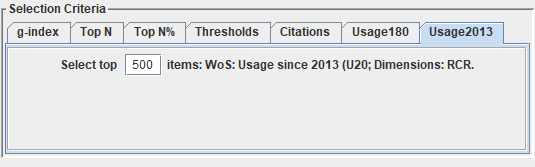
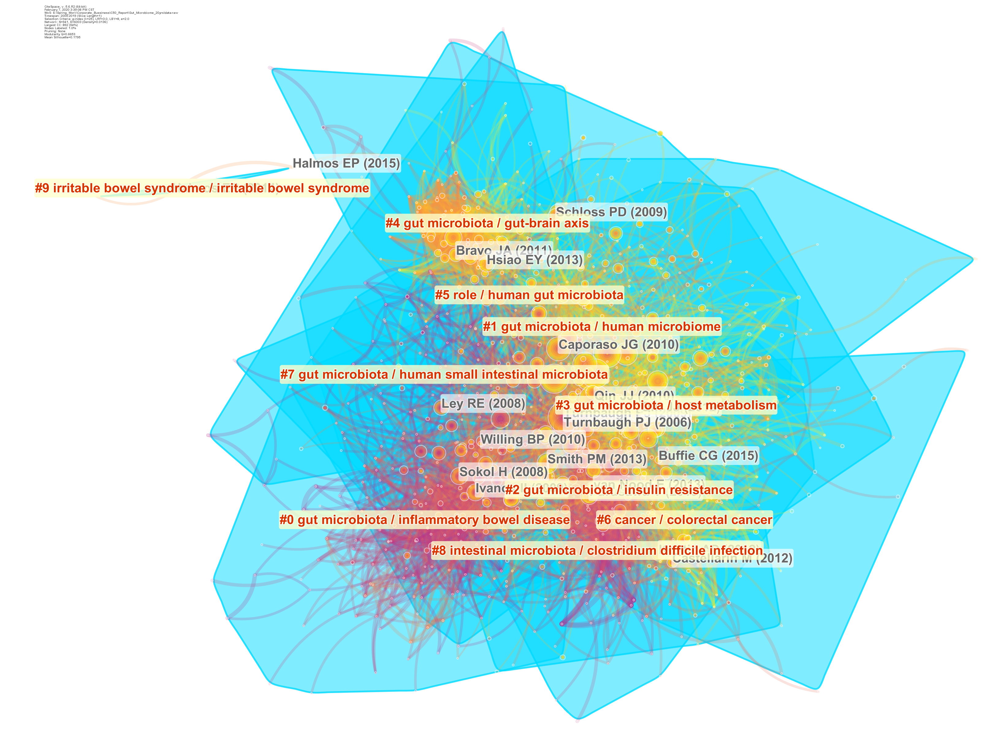
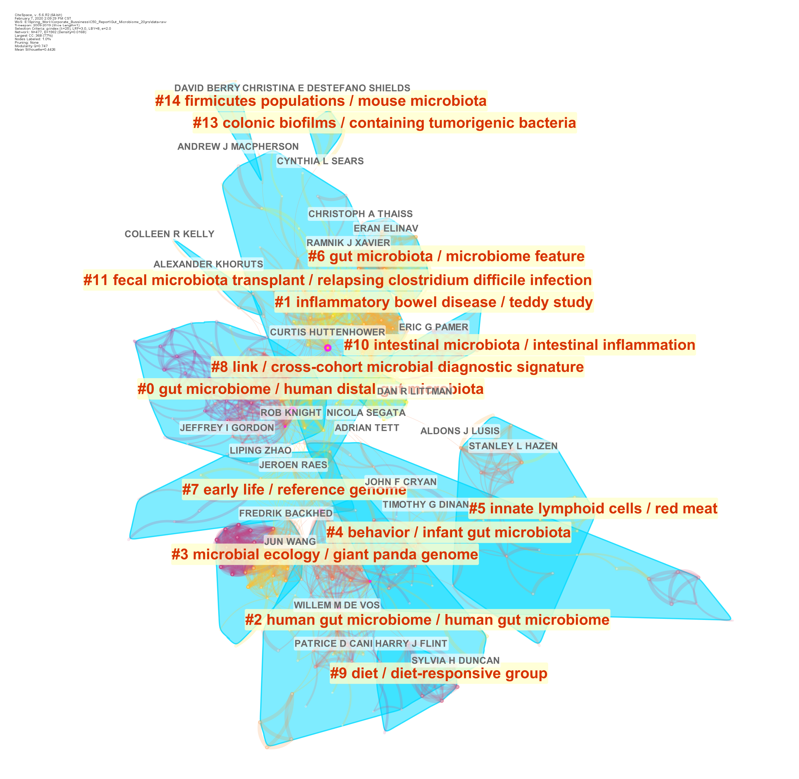

# CiteSpace 网络 {#citespace-network}

我们使用 CiteSpace 软件[@chenCiteSpaceIIDetecting2006]分析了高被引论文的引证网络。

网络的分析要点包括：网络整体结构、网络聚类、各聚类之间的关联、关键节点（转折点）和路径。解读时可从直观显示入手，然后再参考各项指标。

- 结构。能否看到自然聚类（未经聚类算法而能直观判定的组合），观察通过算法能得到几个聚类？是否包括一些重要的节点，如转折点（Pivot node，有紫色外圈的节点，具有高的中介中心性的节点）、标志点（Landmark node，如每个节点大小代表它的总被引次数，节点越大则总被引频次越高）和具有高的度中心性的点（Hub node，枢纽节点，具有高的度中心性）。

- 时间。**CiteSpace 的网络以颜色表示发表时间**。每个自然聚类是否有主导颜色（出现时间相对集中），是否有明显的热点（节点年轮中出现红色年轮，即被引频率是否曾经或仍在急速增加）？通过各个年轮的色彩可判断被引时间分布。时间线显示将每一聚类按时间顺序排列，相邻聚类常常对应相关主题（聚类间共引）。聚类之间的知识流向也可从时间（色彩）上看到（有冷色到暖色）。

- 内容。每个聚类的影响（被引时涉及的主题、摘要、关键词）和几种不同算法所选出的最有代表性的名词短语。CiteSpace 使用几种不同的算法在文章的 Title、Abstract、Keywords中提取聚类的标签[^citespace-label]。标签虽然不一定全面，但是可以反映对应簇的主要研究内容。

[^citespace-label]: 在CiteSpace中,通过从施引文献的标题、关键词或摘要中来提取名词性术语对聚类进行命名。采用的方法主要有TF*IDF, LLR (对数似然率算法)以及MI (互信息算法)三种算法。

- 指标。每个聚类是否具有足够的相似性（silhouette值是否足够大，太小则无明确主题可言），整个聚类是否有足够节点（太少则很可能全都出自同一篇文献的参考文献，因而缺乏普遍意义）。

使用 CiteSpace 进行网络分析的速度很快，但是需要特别注意的是 CiteSpace 默认只会选择一部分的文献进行分析（图 \@ref(fig:citespace-selection-criteria)）。


```{r citespace-selection-criteria,fig.cap="CiteSpace基于多种条件选择文献的子集进行分析"}

```


## 网络分析结果 {#citespace-network-result}

### 文献的引用网络

高被引论文的共被引网络有两个结果。

首先看图 \@ref(fig:citespace-highlycited-reference-network) 展示的高被引论文的共被引网络（部分）。这部分论文是高被引论文中的核心文献（每年引用次数排在前50%）。如前所述，颜色表示论文发表的年份，红色文字表示簇的关键词（关键词分成两个部分，以斜杠分隔，分别由不同的算法和来源）。

主要的共被引网络簇包括：

- IBD
- 人体菌群
- 宿主代谢
- 肠脑轴
- 人体肠道菌群

等等。

不同簇的颜色存在显著的差异，说明各研究主题在时间上是有分隔效应的。

```{r citespace-highlycited-reference-network, fig.cap="高被引论文的共被引网络（部分）"}

```

在纳入更多的高被引文献后，我们可以得到一个更庞大的网络(图 \@ref(fig:citespace-highlycited-reference-network-complete)）。这个网络的结构有更多的“细枝末叶”，结合时间的变迁，可以看到肠道菌群研究由远及近（反应在图中是由外围向中心的趋势）的变迁。

```{r citespace-highlycited-reference-network-complete, fig.cap="高被引论文的共被引网络（完整）"}
include_graphics("citespace/citespace-highlycited-reference-network-complete.png")
```


### 作者的合作网络

我们同样同两个层面分析了高被引论文的作者合作网络（图 \@ref(fig:citespace-highlycited-author-network)， \@ref(fig:citespace-highlycited-author-network-complete)）。


```{r citespace-highlycited-author-network, fig.cap="高被引论文的作者合作网络（部分）"}

```

```{r citespace-highlycited-author-network-complete, fig.cap="高被引论文的作者合作网络（完整）"}
include_graphics("citespace/citespace-highlycited-author-network-complete.png")
```


### 关键词的共现网络


```{r citespace-highlycited-keyword-network, fig.cap="高被引论文的关键词共现网络"}
include_graphics("citespace/citespace-highlycited-keyword-network.png")
```


