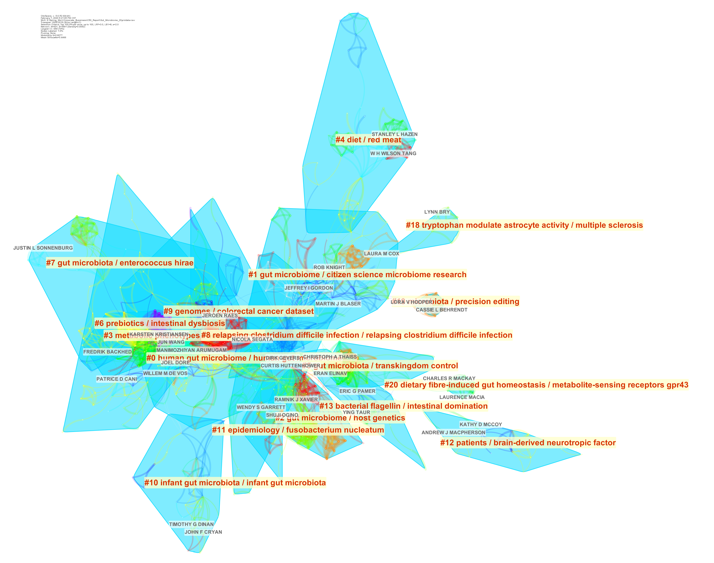
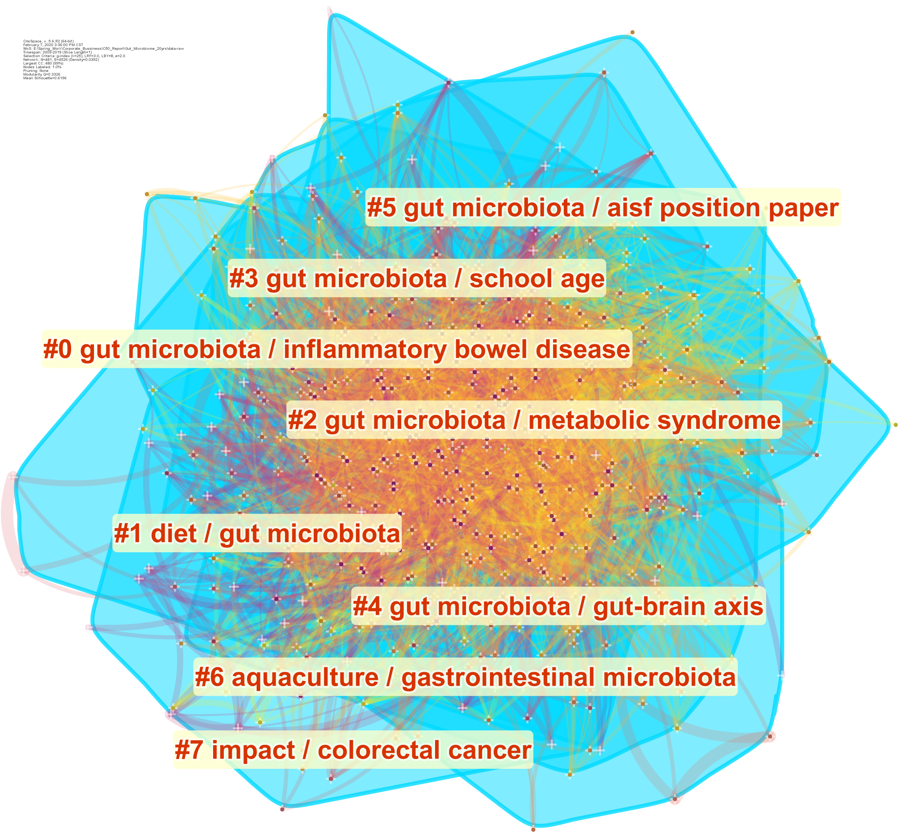

# CiteSpace 网络 {#citespace-network}

我们使用 CiteSpace 软件[@chenCiteSpaceIIDetecting2006]分析了高被引论文的引证网络。

网络的分析要点包括：网络整体结构、网络聚类、各聚类之间的关联、关键节点（转折点）和路径。解读时可从直观显示入手，然后再参考各项指标。

- 结构。能否看到自然聚类（未经聚类算法而能直观判定的组合），观察通过算法能得到几个聚类？是否包括一些重要的节点，如转折点（Pivot node，有紫色外圈的节点，具有高的中介中心性的节点）、标志点（Landmark node，如每个节点大小代表它的总被引次数，节点越大则总被引频次越高）和具有高的度中心性的点（Hub node，枢纽节点，具有高的度中心性）。

- 时间。**CiteSpace 的网络以颜色表示发表时间**。每个自然聚类是否有主导颜色（出现时间相对集中），是否有明显的热点（节点年轮中出现红色年轮，即被引频率是否曾经或仍在急速增加）？通过各个年轮的色彩可判断被引时间分布。时间线显示将每一聚类按时间顺序排列，相邻聚类常常对应相关主题（聚类间共引）。聚类之间的知识流向也可从时间（色彩）上看到（有冷色到暖色）。

- 内容。每个聚类的影响（被引时涉及的主题、摘要、关键词）和几种不同算法所选出的最有代表性的名词短语。CiteSpace 使用几种不同的算法在文章的 Title、Abstract、Keywords中提取聚类的标签[^citespace-label]。标签虽然不一定全面，但是可以反映对应簇的主要研究内容。

[^citespace-label]: 在CiteSpace中,通过从施引文献的标题、关键词或摘要中来提取名词性术语对聚类进行命名。采用的方法主要有TF*IDF, LLR (对数似然率算法)以及MI (互信息算法)三种算法。

- 指标。每个聚类是否具有足够的相似性（silhouette值是否足够大，太小则无明确主题可言），整个聚类是否有足够节点（太少则很可能全都出自同一篇文献的参考文献，因而缺乏普遍意义）。


## 网络分析结果 {#citespace-network-result}

### 文献的引用网络


CiteSpace 分析高被引文献后，我们可以得到一个庞大的网络(图 \@ref(fig:citespace-highlycited-reference-network-complete)）。这个网络的结构有更多的“细枝末叶”，结合时间的变迁，可以看到肠道菌群研究由远及近（反应在图中是由外围向中心的趋势）的变迁。

通过语义分析，软件给出了几十个关键词，用来指代不同的细分研究领域。

其中，最前面的 10 个分别是：

1. cancer therapy
2. multiple effect
3. gut-brain axis
4. *Clostridium difficile* infection
5. hepatic encephalopathy
6. old intuition
7. mosquito midgut microbiota
8. maternal microbial transmission
9. shellfish culture
10. inflammatory disorder


机器学习给出的结果固然与我们自己的感知不同，很多时候甚至是不大准确的。但是，这样的一个结果还是指出了肠道菌群研究中一些相对比较独立的研究领域。

```{r citespace-highlycited-reference-network-complete, fig.cap="高被引论文的共被引网络（完整）"}
include_graphics("citespace/citespace-highlycited-reference-network-complete.png")
```


### 作者的合作网络

我们接下来又分析了高被引论文的作者合作网络（图 \@ref(fig:citespace-highlycited-author-network-complete)）。


```{r citespace-highlycited-author-network-complete, fig.cap="高被引论文的作者合作网络（完整）"}

```


### 关键词的共现网络


关键词的共现网络，联系程度非常紧密，从中得到了 8 个研究主题，分别是：

1. #0 IBD
2. #1 diet
3. #2 metabolic syndrome（代谢综合征）
4. #3 school age
5. #4 gut-brain axis
6. #5 gut microbiota
7. #6 aquaculture/gastrointestinal microbiota
8. #7 colorectal cancer（大肠癌）


```{r citespace-highlycited-keyword-network, fig.cap="高被引论文的关键词共现网络"}

```


