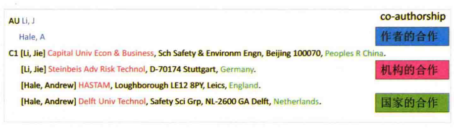

# CiteSpace 网络 {#citespace-network}

我们使用 CiteSpace 软件[@chenCiteSpaceIIDetecting2006]分析了高被引论文的引证网络。

网络的分析要点包括：网络整体结构、网络聚类、各聚类之间的关联、关键节点（转折点）和路径。解读时可从直观显示入手，然后再参考各项指标。

- 结构。能否看到自然聚类（未经聚类算法而能直观判定的组合），观察通过算法能得到几个聚类？是否包括一些重要的节点，如转折点（Pivot node，有紫色外圈的节点，具有高的中介中心性的节点）、标志点（Landmark node，如每个节点大小代表它的总被引次数，节点越大则总被引频次越高）和具有高的度中心性的点（Hub node，枢纽节点，具有高的度中心性）。

- 时间。**CiteSpace 的网络以颜色表示发表时间**。每个自然聚类是否有主导颜色（出现时间相对集中），是否有明显的热点（节点年轮中出现红色年轮，即被引频率是否曾经或仍在急速增加）？通过各个年轮的色彩可判断被引时间分布。时间线显示将每一聚类按时间顺序排列，相邻聚类常常对应相关主题（聚类间共引）。聚类之间的知识流向也可从时间（色彩）上看到（有冷色到暖色）。

- 内容。每个聚类的影响（被引时涉及的主题、摘要、关键词）和几种不同算法所选出的最有代表性的名词短语。CiteSpace 使用几种不同的算法在文章的 Title、Abstract、Keywords中提取聚类的标签[^1]。标签虽然不一定全面，但是可以反映对应簇的主要研究内容。

[^1]: 在CiteSpace中,通过从施引文献的标题、关键词或摘要中来提取名词性术语对聚类进行命名。采用的方法主要有TF*IDF, LLR (对数似然率算法)以及MI (互信息算法)三种算法。

- 指标。每个聚类是否具有足够的相似性（silhouette值是否足够大，太小则无明确主题可言），整个聚类是否有足够节点（太少则很可能全都出自同一篇文献的参考文献，因而缺乏普遍意义）。

使用 CiteSpace 进行网络分析的速度很快，但是需要特别注意的是 CiteSpace 默认只会选择一部分的文献进行分析（图 \@ref(fig:citespace-selection-criteria)）。


```{r citespace-selection-criteria,fig.cap="CiteSpace基于多种条件选择文献的子集进行分析"}
include_graphics("citespace/citespace-selection-criteria.png")
```


## 网络分析的概念 {#network-concept}

### 文献的引用网络

文献的引用网络分析大体可分为两种，共被引和文献耦合网络。

共被引（co-citation）是指当两篇（或多篇）文献同时被后来一篇（或多篇）论文所引用的关系，同时引用这两篇论文的文献数目则称为共被引强度（图 \@ref(fig:co-citation-example)）。文献的共被引关系会随着时间的变化而变化。通过对文献共被引网络的研究可以探究科学的发展和演进动态。

```{r co-citation-example, fig.cap="共被引关系的示意图"}
include_graphics("citespace/co-citation-example.png",dpi = NA)
```

文献耦合（coupling）是指若文献A和文献B引证了相同的参考文献，则它们之间构成耦合关系，它们所包含相同参考文献的个数成为耦合强度。如果两篇文献同时引用了1篇文献，则耦合度为1；若同时引用了3篇文献，则耦合度为3。两篇文献拥有的共同参考文献越多，则其研究内容越相似（图 \@ref(fig:coupling-example)）。

```{r coupling-example, fig.cap="文献耦合的示意图"}
include_graphics("citespace/coupling-example.png",dpi = NA)
```


从文献耦合的概念上看，一个文献引用的参考文献越多，那么它将有越多的机会与其它文献建立耦合关系。为了消除这种影响，通常需要对原始数据使用 Jaccard 或 Salton 方法进行标准化处理，来计算相对的耦合强度。文献耦合测量的是文献间的静态关系，已经发表的论文的耦合强度不会随时间的变化而变化。


### 合作网络

合作网络可以有多重表现形式，存在于作者、机构和国家等不同层面。只要在同一篇文献中同时出现，就可以视为一种合作（图 \@ref(fig:co-authorship-example)）。


```{r co-authorship-example,fig.cap="合作网络的体现形式"}

```


### 共词分析

共词分析的基本原理是对一组词两两统计他们在同一组文献中出现的次数,通过这种共现次数来测度他们之间的亲疏关系。共词分析的一般过程如图 \@ref(fig:co-occurance-example) 所示。通常是提取每一篇论文的关键词列表，这里P1表示文献1,K1表示关键词1,相同的关键词使用相同的字母和数字组合表示。这样就可以得到一个文档-关键词矩阵，该矩阵为0-1矩阵,表达的含义关键词和文献的隶属关系。

```{r co-occurance-example,fig.cap="共词关系的示意图"}
include_graphics("citespace/co-occurance-example.png")
```


## 网络分析结果 {#citespace-network-result}

### 文献的引用网络

高被引论文的共被引网络有两个结果。

首先看图 \@ref(fig:citespace-highlycited-reference-network) 展示的高被引论文的共被引网络（部分）。这部分论文是高被引论文中的核心文献（每年引用次数排在前50%）。如前所述，颜色表示论文发表的年份，红色文字表示簇的关键词（关键词分成两个部分，以斜杠分隔，分别由不同的算法和来源）。

主要的共被引网络簇包括：

- IBD
- 人体菌群
- 宿主代谢
- 肠脑轴
- 人体肠道菌群

等等。

不同簇的颜色存在显著的差异，说明各研究主题在时间上是有分隔效应的。

```{r citespace-highlycited-reference-network, fig.cap="高被引论文的共被引网络（部分）"}

```

在纳入更多的高被引文献后，我们可以得到一个更庞大的网络(图 \@ref(fig:citespace-highlycited-reference-network-complete)）。这个网络的结构有更多的“细枝末叶”，结合时间的变迁，可以看到肠道菌群研究由远及近（反应在图中是由外围向中心的趋势）的变迁。

```{r citespace-highlycited-reference-network-complete, fig.cap="高被引论文的共被引网络（完整）"}
include_graphics("citespace/citespace-highlycited-reference-network-complete.png")
```


### 作者的合作网络

我们同样同两个层面分析了高被引论文的作者合作网络（图 \@ref(fig:citespace-highlycited-author-network)， \@ref(fig:citespace-highlycited-author-network-complete)）。


```{r citespace-highlycited-author-network, fig.cap="高被引论文的作者合作网络（部分）"}
include_graphics("citespace/citespace-highlycited-author-network.png")
```

```{r citespace-highlycited-author-network-complete, fig.cap="高被引论文的作者合作网络（完整）"}
include_graphics("citespace/citespace-highlycited-author-network-complete.png")
```


### 关键词的共现网络


```{r citespace-highlycited-keyword-network, fig.cap="高被引论文的关键词共现网络"}
include_graphics("citespace/citespace-highlycited-keyword-network.png")
```


# LCS 核心文献的网络分析 {#core-article-network}


为了理清 LCS 核心文献随时间演变的脉络，我们构建了一个历史共被引网络（historical co-citation network）。


```{r}
# histNet <- histNetwork(MC,min.citations = 10)
# saveRDS(histNet,"data/histNet.RDS")
histNet <- readRDS("data/histNet.RDS")
histNetGraph <- histPlot(histNet,n=30)
```


```{r}
# 计算出现矩阵
MC <- data.frame(MC)
matrix <- cocMatrix(MC, Field = "CR")
colnames(matrix) <- trimws(colnames(matrix))
rownames(matrix) <- gsub(pattern = ",", replacement = "",MC$SR)
```


```{r}
# 去掉外围文献，法一：通过名称选取
from <- rownames(matrix)
to <- colnames(matrix)
idx <- intersect(from,to)
mat <- matrix[idx,idx]

# 去掉外围文献，法二：通过提取Top节点
order(colSums(matrix))
```


```{r}
# 利用出现矩阵计算 nodes 和 edges
df <- as.data.frame.matrix(mat)
nodes <- data.frame(name = rownames(mat))
colnames(df) <- seq_along(nodes$name)
df$from <- seq_along(nodes$name)
edges <- df %>% 
  pivot_longer(cols = - from, names_to = "to") %>%
  filter(value > 0) %>%
  select(-value) %>%
  mutate_all(as.numeric)
```

```{r}
require(tidygraph)
graph <- tbl_graph(nodes = nodes, edges = edges)
```

## 共被引网络

```{r eval=F}
n <- 100
MC <- data.frame(MC)
rownames(MC) <- MC$SR
WA <- cocMatrix(MC, Field = "CR")
s <- head(order(colSums(WA),decreasing = TRUE),n)
m <- Matrix::crossprod(WA[,s],WA[,s])
m <- normalizeSimilarity(m,type = "jaccard")
graph <- graph_from_adjacency_matrix(m, mode = "undirected",weighted = TRUE)
graph <- simplify(graph)
graph$layout <- layout_with_kk(graph)
group <- cluster_fast_greedy(graph)
reference_cocitation_network <- list(graph=graph,group=group)
saveRDS(reference_cocitation_network, file = "data/reference_cocitation_network.RDS")

```


```{r reference-cocitation-network, fig.cap="LCS核心论文的共被引网络（100篇）"}
reference_cocitation_network <- readRDS("data/reference_cocitation_network.RDS")
graph <- reference_cocitation_network$graph
group <- reference_cocitation_network$group
plot(group,
     graph,
     vertex.label=NA,
     edge.color = "black",
     edge.curved = TRUE)  # 不显示点的名称
```

LCS 核心文献的共被引网络的结构是非常紧密的（图 \@ref(fig:reference-cocitation-network)），
其模块化水平仅有 `r modularity(group)` （数值越小，模块化水平越低）。
在这幅图中，节点按照 `r length(unique(membership(group)))` 个组分别着色。
准确的说，在这样的100篇核心论文中，当使用 `cluster_fast_greedy()` 方法聚类时，
分别有 `r paste0(table(membership(group)),collapse="/")` 个元素（图 \@ref(fig:co-citation-network-group)）。

根据共被引的定义，当两篇文献同时被后来发表的一篇文献引用时，
先发表的这两篇文献就具有了共被引关系。
因此，在文献总量较大的背景下，前一百篇引用次数最多的文献中，
任意两篇被共引的概率还是相当大的。
这就导致共被引网络形成了一个联系非常紧密的结构。


```{r co-citation-network-group, fig.width=6,fig.cap="聚类后每个簇的节点数目"}
barplot(table(membership(group)))
```


## 文献耦合网络

文献耦合是衡量研究相似性的一个方法，耦合度高的文献研究内容理论上更接近。
因此，我们使用耦合网络来分析研究中不同的方向。
耦合网络与共被引不同的一点在于耦合关系是固定的，不随时间变动。
因此，我们可以分别获得每年发表文献之间的耦合关系。

```{r eval=F}
reference_coupling_networks <- lapply(2000:2019, function(year){
  m <- MC %>% filter(PY==year)
  m <- data.frame(m)
  rownames(m) <- m$SR
  mat <- biblioNetwork(m, network = "references")
  net <- networkPlot(NetMatrix = mat, 
                     normalize = "jaccard", 
                     weighted = TRUE,        # set to TRUE if use normalized matrix 
                     n=50, 
                     type="kamada",
                     halo=TRUE,
                     cluster="fast_greedy",
                     Title = year, 
                     verbose = FALSE)
  return(net)
})

saveRDS(reference_coupling_networks, file = "data/reference_coupling_networks.RDS")
```

```{r}
reference_coupling_networks <- readRDS("data/reference_coupling_networks.RDS")
```

2019年的文献耦合网络展示前 50 篇文献间的耦合关系。
从图中可以看出（图 \@ref(fig:reference-coupling-network-2019)），
它们的耦合关系也是非常密切的。

```{r reference-coupling-network-2019,fig.cap="2019年的文献耦合网络"}
g <- reference_coupling_networks[[20]]$graph
plot(g, vertex.label=NA)
```


## 合作网络

```{r eval=F}
author_collaboration_networks <- lapply(2000:2019, function(year){
  m <- MC %>% filter(PY==year)
  m <- data.frame(m)
  rownames(m) <- m$SR
  mat <- biblioNetwork(m, analysis = "co-occurrences", network = "authors")
  net <- networkPlot(NetMatrix = mat, 
                     n=300, 
                     cluster = "fast_greedy",
                     type="kamada",
                     halo=TRUE,
                     Title = year, 
                     verbose = FALSE)
  return(net)
})

saveRDS(author_collaboration_networks, file = "data/author_collaboration_networks.RDS")
```

```{r}
author_collaboration_networks <- readRDS("data/author_collaboration_networks.RDS")

```


```{r author-collaboration-network-2019,fig.cap="2019年的作者合作网络"}
g <- author_collaboration_networks[[20]]$graph
plot(g, vertex.label=NA)
```

2019年的作者合作网络展示前 300 名作者之间的合作关系。
从图中可以看出（图 \@ref(fig:author-collaboration-network-2019)），
作者的合作网络是一个模块化比较明显的网络，
其模块化水平为 `r modularity(cluster_fast_greedy(g))`。

但是，需要警惕的是：这种模块化可能仅仅代表着几篇重要论文的共同作者而已，
并不能代表研究人员之间广泛的合作。

## 国家的合作网络


```{r eval=F}
country_collaboration_networks <- lapply(2000:2019, function(year){
  m <- MC %>% filter(PY==year)
  m <- data.frame(m)
  rownames(m) <- m$SR
  mat <- biblioNetwork(m, analysis = "co-occurrences", network = "countries")
  net <- networkPlot(NetMatrix = mat, 
                     weighted = TRUE,
                     n=100, 
                     Title = year, 
                     verbose = FALSE)
  return(net)
})

saveRDS(country_collaboration_networks, file = "data/country_collaboration_networks.RDS")
```

```{r}
country_collaboration_networks <- readRDS("data/country_collaboration_networks.RDS")
```

```{r country-collaboration-network-2019,fig.cap="2019年的关键词共词网络"}
g <- country_collaboration_networks[[20]]$graph
plot(g, vertex.label=NA)
```

2019年的国家合作网络展示前 100 名国家之间的合作关系。
从图中可以看出（图 \@ref(fig:country-collaboration-network-2019)），
国家的合作网络是一个模块化不明显的网络，
其模块化水平为 `r modularity(cluster_fast_greedy(g))`。


## 关键词共词网络

```{r eval=F}
keyword_cooccurrence_networks <- lapply(2000:2019, function(year){
  m <- MC %>% filter(PY==year)
  m <- data.frame(m)
  rownames(m) <- m$SR
  mat <- biblioNetwork(m, analysis = "co-occurrences", network = "keywords")
  net <- networkPlot(NetMatrix = mat, 
                     # normalize = "jaccard", 
                     weighted = TRUE,
                     n=300, 
                     Title = year, 
                     verbose = FALSE)
  return(net)
})

saveRDS(keyword_cooccurrence_networks, file = "data/keyword_cooccurrence_networks.RDS")

```

```{r}
keyword_cooccurrence_networks <- readRDS("data/keyword_cooccurrence_networks.RDS")
```


```{r keyword-cooccurrence-network-2019,fig.cap="2019年的关键词共词网络"}
g <- keyword_cooccurrence_networks[[20]]$graph
plot(g, vertex.label=NA)
```


2019年关键词共词网络展示前 300 个关键词之间的联系（图 \@ref(fig:keyword-cooccurrence-network-2019)）。

总体来看，网络的连接度普遍较强。
为了降低连接度，下一步应当对网络中的连接强度进行过滤，
即使用带权重的网络进行分析。


