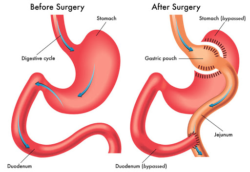

## 糖尿病 {#diabetes}


该病与肠道菌群之间究竟存在哪些联系呢？通过这一部分的分析，或许可以帮助我们找到问题的答案。

### 糖尿病相关研究的核心论文

```{r}
result <- disease_dt_output("diabetes")
diabetes <- result$data
result$widget
```


简单统计一下，可以发现相关研究的主体中，美国独占鳌头，但是其它国家之间的差距并不明显。
这说明糖尿病作为一个世界性流行病，在各国基本上都会有比较多的研究（图 \@ref(fig:diabetes-four-dimension-barplot)A）。

十大顶尖的研究机构中，出现了多个并不常见的机构（图 \@ref(fig:diabetes-four-dimension-barplot)B），
它们分别是 天主教鲁汶大学（比利时）、哥本哈根大学（丹麦）、赫尔辛基大学（芬兰）、
哥德堡大学（瑞典）、图尔库大学（芬兰）、华大基因（中国）、法国农科院、瓦格宁根大学（荷兰）、
克利夫兰医学中心（美国）、法国国家健康与医学研究院等。**总的来看，欧洲多个机构的研究贡献卓著**。

```{r}
four_dimension_barplot_caption <- paste0("糖尿病",
                                         "相关研究的简要信息。",
                                         "（A）发表文章最多的10个国家；",
                                         "（B）发表文章最多的10家机构；",
                                         "（C）发表文章最多的10位科学家；",
                                         "（D）发表文章最多的10本杂志。")
```


```{r diabetes-four-dimension-barplot, fig.cap=four_dimension_barplot_caption}
four_dimension_barplot(diabetes)
```


在十大科学家的名单中，名列第一位的是 Cani， Patrice D教授，他来自于天主教鲁汶大学。
他实验室的研究兴趣是肠道菌群在代谢性疾病（例如肥胖症，2型糖尿病和低度炎症）发展中的作用。
Patrice D Cani 教授在肠道菌群方面的研究已经持续了 18 年之久，他有一句箴言：“In Gut We Trust”。
他甚至还以此为名建立了一个网站：[IN Gut We trust](http://ingutwetrust.org)。

名列第二位的是 Fredrik Bäckhed 教授。他来自于赫尔辛基大学，是一位细胞微生物学和小鼠生理学专家。
他的工作是将临床研究与无菌小鼠模型相结合，以解决正常肠道菌群在代谢疾病中的作用。

其他的科学家在此不一一介绍了。

在十大来源期刊中，GUT、Nutrients、Nature 杂志拔得前三（图 \@ref(fig:diabetes-four-dimension-barplot)D）。
接下来是四个与糖尿病研究密切相关的专业刊物，Diabetes、Nature Reviews Endocrinology、Diabetes Care、
Diabetologia 等。第 8 - 10 位的则分别是 Gastroenterology、Science 和 Cell。
在糖尿病研究领域，专业性期刊的贡献非常突出。

### 糖尿病相关研究的合作网络

进一步地，我们看看相关机构和科学家的合作网络（图 \@ref(fig:diabetes-university-net)）。

糖尿病的相关研究体系，欧洲的机构占主流地位。图中红色和蓝色的子网络中基本都是欧洲的研究机构。
除此之外，绿色的子网络中包括了几个美国的研究单位，主要是 哈佛大学和 MIT 系统。
而橙色的部分，在哥本哈根大学之外，出现了三个来自于中国的机构，分别是中科院大学、中科院和华大基因。

```{r diabetes-university-net, fig.cap="癌症研究的机构合作网络"}
university_network(diabetes,edge_weight_cutoff = 3,nNode = 30,delete_isolate=T)
```


我们取前 30 位发表文章数量最多的作者，分析他们的合作网络（图 \@ref(fig:diabetes-author-net)）。
发现他们主要组成了五个相对独立的学术群体。


```{r diabetes-author-net, fig.cap="癌症研究的作者合作网络"}
author_network(diabetes,edge_weight_cutoff = 3,nNode = 30,delete_isolate=T) 
```

### 糖尿病相关研究的历史脉络

#### 小白鼠先行，发现糖尿病与肠道菌群之间的重要关联

通过历史引证网络梳理相关研究的脉络。在图 \@ref(fig:diabetes-histplot) 中，
一共展示了 21 篇最关键的研究论文。
这 21 篇论文的发表年限介于 2007 - 2017 年之间。
这些论文的具体信息可以参阅图 \@ref(fig:diabetes-histplot-articles)。


如图 \@ref(fig:diabetes-histplot) 所示，最早的一批成果中，有 4 项研究的第一作者都是 Cani PD，
分别发表在 2007 年，2008 年和 2009 年。
看文章内容应当是同一项研究的不同成果
[@caniChangesGutMicrobiota2008; @caniChangesGutMicrobiota2009; @caniMetabolicEndotoxemiaInitiates2007; @caniSelectiveIncreasesBifidobacteria2007]。
在这项研究中，通过高脂饮食诱导在小鼠中建立了肥胖和糖尿病模型，并进一步研究了相应的机制，
主要的结论包括：

- 高脂饮食可以诱导小鼠产生肥胖和糖尿病；
- 糖尿病小鼠中，肠道菌群中的双歧杆菌含量增加；
- 小鼠患病的原因在于内毒素诱导的身体炎症；
- 内毒素是由肠道菌群代谢产生的；
- 肠道菌群可以控制代谢产生的内毒素，进而影响肥胖和糖尿病小鼠体内的炎症反应；
- 在肠道菌群发挥作用的过程中，类胰高血糖素-2（GLP-2）是重要因子。

这一系列文章中，在动物模型中逐步明确了肠道菌群在糖尿病中作用，并发现了肠道菌群的代谢产物是重要的效应分子。

类似的，2008 年发表的另一篇研究中，也是用小鼠模型，发表在 Nature 杂志，主要
研究了固有免疫缺陷时导致的肠道菌群改变是 1 型糖尿病的重要成因[@wenInnateImmunityIntestinal2008]。

接下来，2010 年在 Science 杂志也发表了一篇比较类似的研究，在缺失了 Toll 样受体-5（TLR5）的小鼠中，
发现了肠道菌群的改变和代谢综合征[@vijay-kumarMetabolicSyndromeAltered2010]。
TLR5 与 前一篇研究缺失的 MyD88 蛋白都是固有免疫的重要受体蛋白，
当此类蛋白缺失时，会引起肠道菌群的改变，从而诱发包括糖尿病在内的代谢综合征的发生。


```{r diabetes-histplot, fig.cap="心血管疾病相关研究的历史脉络"}
hist_graph <- histPlot(histNetwork(diabetes %>% filter(DT == "ARTICLE"), verbose = FALSE), verbose = FALSE)
```


#### 人群中验证，明确了肠道菌群在糖尿病中的关键作用

截至目前，所有的研究都是在**小鼠**中进行的，包括基因缺陷小鼠和无菌小鼠的模型。
接下来的研究中，则出现了以人为对象的临床研究。

第一项研究是在进行过胃旁路手术的群体中开展的[@furetDifferentialAdaptationHuman2010]。
该手术是一项有效和流行的减肥手术，主要是通过在胃中造一个小室与小肠直接相连，
减少食物在体内的滞留时间，从而达到减肥的效果（图 \@ref(fig:gastric-bypass)）。


```{r gastric-bypass, fig.cap="胃旁路手术前后示意图"}

```

在该项研究中，一共纳入了 43 人，其中 13 人是对照，另外 30 人是肥胖患者，并接受了这一手术。
在术前和术后 3 个月、6 个月进行粪便取样，使用定量 PCR 技术分析了肠道菌群阶段性的变化。
研究揭示了一些发生显著变化的菌群类型，并表示菌群能够适应饥饿诱导的肠道环境，
进而形成新的稳态。


2010 年发表在 PLoS One 杂志上的另一项研究中，
分析了 2 型糖尿病患者与健康成年男性之间的肠道菌群差异[@larsenGutMicrobiotaHuman2010]。
一共纳入了 54 名对象，其中 36 人为对照，另外 18 人为 2 型糖尿病患者。
该研究中采用了新兴的 16S rRNA 基因测序技术，发现了糖尿病患者的菌群特征，包括：

- 厚壁菌门和梭菌门在糖尿病患者体内下降；
- β-变形菌在糖尿病患者体内富集；
- 拟杆菌门/厚壁菌门、拟杆菌/普氏菌等比值与血糖浓度存在显著相关性。


2010 年发表在 ISME J 上的一篇研究，
则分析了 1 型糖尿病人群中的菌群特征[@giongoDefiningAutoimmuneMicrobiome2011]。

- 发现了卵形拟杆菌（*Bacteroides ovatus*）在 1 型糖尿病中升高的现象比较普遍；
- 相反的，厚壁菌 CO19 则在非 1 型糖尿病患者的对照人群中普遍较高。


#### 饮食干预出手，让“食疗”成为可能

在 2011 年发表在 Diabetes 杂志上的一篇研究中，则通过益生元饮食对小鼠糖尿病进行了干预。
益生元干预后，糖尿病小鼠的肠道菌群显著改变，且图图图耐受性等相关指标有所提高。
这表明，通过饮食干预可以缓解或者治疗小鼠的糖尿病和肥胖[@everardResponsesGutMicrobiota2011]。


```{r diabetes-histplot-articles, fig.cap="糖尿病相关研究的关键节点文献"}
cap <- "糖尿病相关研究的关键节点文献"
vip <- extract_from_hist_graph(diabetes, hist_graph)
produce_topic_article_datatable(vip, cap, cap)
```


### 糖尿病相关的重要研究主题

```{r}
diabetes_keyword_net_cap <- paste0("糖尿病相关的研究主题。",
                              "在这个共现网络中，显示最多不超过 50 个最常见的节点，",
                              "且为突出网络主题，去掉了类似于 Gut Microbiota 的一般词汇",
                              "以及共现次数小于 3 次的连接")
```


在糖尿病相关研究中出现最多的关键词组成了共现网络，从中可以看出相关研究的一些主要方向。
在这其中，胰岛素抗性和胰高血糖素样肽-1是最突出的研究热点。
除此之外，还有较多与饮食、肥胖、代谢等相关的关键词（图 \@ref(fig:diabetes-keyword-net)）。


```{r diabetes-keyword-net, fig.cap=diabetes_keyword_net_cap}
keyword_network(diabetes,edge_weight_cutoff = 5,nNode = 50,delete_isolate=T,
                remove_keyword = search_keyword_regex) %>%
  visOptions(manipulation = TRUE)

```
