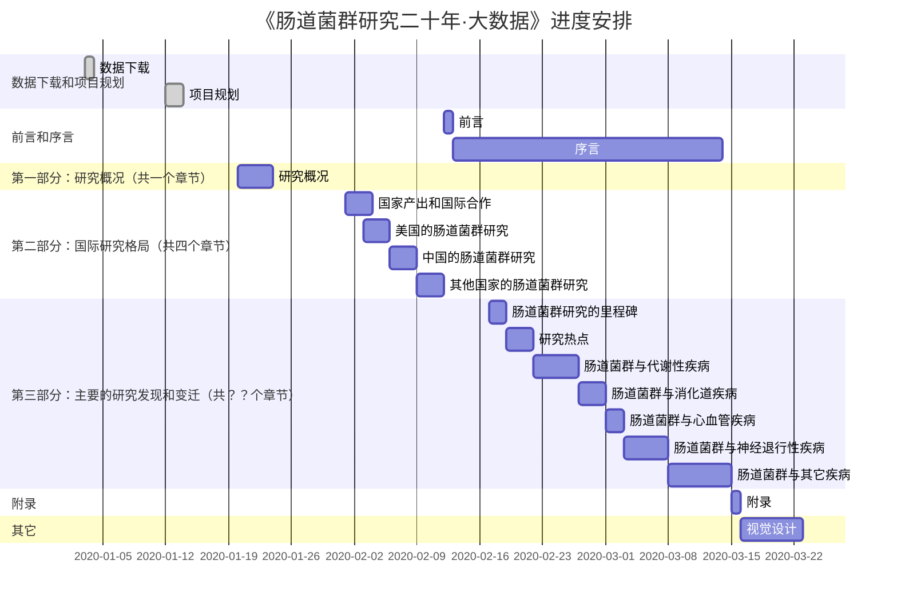

# 肠道菌群研究二十年·大数据

## 进度安排

全书分成“研究概况”，“国际研究格局”和“主要研究发现和变迁”等几大部分，初步列出计划如下：

- 年前将研究概况写完；
- 年后用半个月时间写完第二部分；
- 之后用一个月时间写完第三部分；
- 前言、序言和附录等部分插空安排。

按计划争取在 2020年3月中旬出手稿。

```mermaid

gantt
dateFormat YYYY-M-D
title 《肠道菌群研究二十年·大数据》进度安排

section 数据下载和项目规划
数据下载: done, 2020-1-3, 1d
项目规划: done, 2020-1-12, 2d

section 前言和序言
前言: des1, after des7, 1d
序言: des2, after des1, 30d

section 第一部分：研究概况（共一个章节）
研究概况: des3, 2020-1-20, 4d

section 第二部分：国际研究格局（共四个章节）
国家产出和国际合作: des4, 2020-2-1, 3d
美国的肠道菌群研究: des5, 2020-2-3, 3d
中国的肠道菌群研究: des6, after des5,3d
其他国家的肠道菌群研究: des7, after des6,3d

section 第三部分：主要的研究发现和变迁（共？？个章节）
肠道菌群研究的里程碑: des8, 2020-2-17, 2d
研究热点: des9, after des8, 3d
肠道菌群与代谢性疾病: des10, after des9, 5d
肠道菌群与消化道疾病: des11, after des10, 3d
肠道菌群与心血管疾病: des12, after des11, 2d
肠道菌群与神经退行性疾病: des13, after des12, 5d
肠道菌群与其它疾病: des14, after des13, 7d

section 附录
附录: des15, after des14, 1d

section 其它
视觉设计: des16, after des15, 7d


```